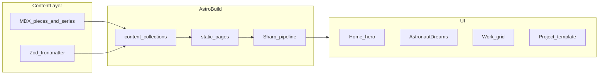

# Task: portfolio-v1 — Griffin 3D portfolio (Astro)

Ship a local-only, static portfolio for 3D stills: editorial brutalist UI, disappearing chrome, and a 12-piece **Astronaut Dreams** exhibition — placeholders first, real renders swapped later.

## TL;DR

- **Problem:** No site yet; ~130 source images exist offline, only a curated subset ships in v1.
- **Fix:** Greenfield **Astro + MDX** at `/Users/coj/src/griffin-portfolio` with file-based content, placeholder heroes, and a batch image script for later swap.
- **Main layers:** `src/content/` (pieces + series), `src/pages/` (routes), `src/components/editorial/` (layout + UI).
- **Out of scope v1:** deploy, CMS, shop/prints, full 130-image archive, WebGL, contact form backend.

---

## Quickstart (implementer)

1. `cd /Users/coj/src/griffin-portfolio`
2. `git init && git checkout -b feature/portfolio-v1-astro` *(no remote/default branch yet — first commit establishes baseline)*
3. `npm create astro@latest . -- --template minimal --typescript strict --install`
4. `npx astro add mdx`
5. Touch `src/content/config.ts` (Zod schema) — first structural file after scaffold
6. `npm run dev` — verify empty site loads before styling pass

---

## How do I…

| Goal | Go to |
|------|--------|
| See locked product decisions | [At a glance](#at-a-glance) |
| Know what “done” means | [Acceptance criteria](#acceptance-criteria) |
| Verify without a test harness | [Test-first plan](#test-first-plan) |
| Follow build order | [Implementation checklist](#implementation-checklist) |
| Understand folder layout | [Solution — primary](#solution) |
| Know what we are not building | [Out of scope](#out-of-scope-v1) |

---

## At a glance

| Constant | Value |
|----------|--------|
| Issue / ticket | **None** — local kickoff from brainstorm + prior plan |
| Repo path | `/Users/coj/src/griffin-portfolio` |
| Repo state | **Not a git repo** (only `.cursor/plans/` exists) |
| Branch (implementation) | `feature/portfolio-v1-astro` |
| Stack | Astro + MDX + TypeScript + Sharp (via Astro assets) |
| Deploy | Local only (`dev` / `build` / `preview`) |
| Assets v1 | Placeholders; ~130 real images swapped later via script |
| Flagship series | Astronaut Dreams — **12** works on `/astronaut-dreams` |
| Home | Cold open on full-bleed still (no “Enter” gate) |
| Commerce | Purely digital — no print/edition copy |

---

## Source

- **Link / ID:** No Linear or GitHub issue. Source = planning chat (audience, visuals, stack, diff choices) + [`.cursor/plans/griffin_portfolio_v1_34fee3c5.plan.md`](.cursor/plans/griffin_portfolio_v1_34fee3c5.plan.md) (prior draft).

### Evidence vs assumptions

**Evidence**

- *Brainstorm — audience:* community + galleries/curators.
- *Brainstorm — media:* stills primary; occasional click-to-play loops.
- *Brainstorm — visual:* editorial brutalist (C), hardcore.
- *Brainstorm — motion:* subtle only.
- *Brainstorm — signatures:* disappearing UI + Astronaut Dreams series.
- *Brainstorm — stack:* static fast (Astro-class).
- *Brainstorm — cadence:* rare overhauls → file-based content, not CMS.
- *Open Q answers:* 12 series works; home = image cold open; purely digital.
- *Implementation Q answers:* local-only deploy; placeholder images first.
- *Repo survey:* directory empty except plan file; `git` reports not a repository.

**Assumptions**

- Artist name/branding **“Griffin”** from workspace path — confirm legal/footer name if different.
- Placeholder SVG/gradient stubs are acceptable until real renders are curated (~20–30 on grid, 12 in series).
- Self-hosted display grotesk is OK (no licensed font purchase in v1); system condensed fallback acceptable.
- Social/contact links on About/Contact can be `mailto:` + placeholder URLs until provided.
- One representative **process strip** on Astronaut Dreams (not on every project page).

---

## User stor(y/ies)

**Story 1 — Community viewer**

As a **fan or fellow artist**, I want to **land on a full-bleed still and browse work in a bold editorial layout**, so that **the portfolio feels shareable and mood-first without clutter**.

**Story 2 — Curator / gallery visitor**

As a **curator**, I want **Astronaut Dreams presented as a numbered 12-piece exhibition with credits and tools**, so that **I can assess the series as a coherent body of work**.

**Technical story — Maintainer (Griffin)**

As the **site owner**, I want **MDX files and a batch image script**, so that **I can drop a curated update every few months without CMS overhead**.

---

## Acceptance criteria

### MVP

- [ ] **AC-1:** Home loads with immediate full-viewport hero still — no title/“Enter” gate.
- [ ] **AC-2:** `/astronaut-dreams` shows title plate, statement, **exactly 12** ordered works (`01/12` … `12/12`), one process strip, digital colophon.
- [ ] **AC-3:** Disappearing nav hidden on load; appears after scroll (&gt;80px) or pointer near top; links: Work, Astronaut Dreams, About, Contact.
- [ ] **AC-4:** `/work` shows asymmetric grid with **≥20** placeholder entries; filter by `series` and `year`.
- [ ] **AC-5:** `/work/[slug]` shows full-bleed hero, credits overlay (hover desktop / tap mobile), optional gallery, optional process strip, `←`/`→` prev-next within series.
- [ ] **AC-6:** No print, edition, or shop language anywhere.
- [ ] **AC-7:** `npm run build` completes; images optimized via Astro asset pipeline.
- [ ] **AC-8:** README documents quickstart, add-piece flow, placeholder → real asset swap.

### Follow-up (explicitly not MVP)

- [ ] Deploy to Vercel/Netlify — *cut: local-only v1*
- [ ] Archive page for remaining ~70+ images — *cut: curation pass later*
- [ ] Pagefind search, CMS, contact form — *cut: rare-update model*
- [ ] Automated E2E (Playwright) — *cut: no harness yet*

### AC → verification

| AC | What must be true | How we verify |
|----|-------------------|---------------|
| AC-1 | Hero fills viewport on first paint | Manual step 1 in [Test-first plan](#test-first-plan) |
| AC-2 | 12 sequence blocks + colophon | Manual step 3; count DOM sections or visible index labels |
| AC-3 | Nav visibility toggles | Manual step 2 (scroll + reduced-motion check) |
| AC-4 | Grid asymmetry + filters | Manual step 4; visual + query param behavior |
| AC-5 | Project template complete | Manual step 5; keyboard nav in series |
| AC-6 | No commerce copy | `rg -i 'print\|edition\|shop'` → no matches in `src/` |
| AC-7 | Production build | `npm run build` exit 0 |
| AC-8 | Docs | README sections present per checklist item 10 |

---

## Test-first plan

**Feasibility:** **No** — greenfield Astro site has no test harness in repo.

**Substitute:** Numbered **manual smoke protocol** + build gate. Add Playwright in a follow-up if regressions become painful.

| Step | Action | Maps to |
|------|--------|---------|
| 1 | `npm run dev` → open `/` — hero is full-bleed; no enter screen | AC-1 |
| 2 | Scroll page — nav appears; enable `prefers-reduced-motion` — no fade animations | AC-3 |
| 3 | Open `/astronaut-dreams` — count 12 works; process strip on one piece; no print copy | AC-2, AC-6 |
| 4 | Open `/work` — ≥20 items; toggle series/year filters | AC-4 |
| 5 | Open series piece — overlay credits; `←`/`→` moves within Astronaut Dreams | AC-5 |
| 6 | `npm run build && npm run preview` — repeat steps 1–3 on preview URL | AC-7 |

**Red-first alternative (optional thin slice):** If adding Vitest, first case could assert `getCollection('pieces')` returns 12 `astronaut-dreams` slugs matching `series.pieceSlugs` — defer unless implementer wants contract tests early.

---

## Solution

### Primary

**Astro (minimal template) + MDX content collections + Zod schema + astro:assets/Sharp.**

**Touchpoints (new files):**

- [`src/content/config.ts`](src/content/config.ts) — `pieces` + `series` collections
- [`src/content/pieces/*.mdx`](src/content/pieces/) — one file per work (27+ seeds)
- [`src/content/series/astronaut-dreams.mdx`](src/content/series/astronaut-dreams.mdx) — statement, `pieceSlugs` (12)
- [`src/pages/index.astro`](src/pages/index.astro), [`astronaut-dreams.astro`](src/pages/astronaut-dreams.astro), [`work/index.astro`](src/pages/work/index.astro), [`work/[slug].astro`](src/pages/work/[slug].astro)
- [`src/components/layout/DisappearingNav.astro`](src/components/layout/DisappearingNav.astro)
- [`src/components/editorial/*`](src/components/editorial/) — TitlePlate, AsymmetricGrid, ProcessStrip, CreditsOverlay
- [`src/components/media/OptimizedImage.astro`](src/components/media/OptimizedImage.astro)
- [`scripts/prepare-images.mjs`](scripts/prepare-images.mjs) — batch WebP + OG when real assets arrive
- [`README.md`](README.md)

**Content shape (pieces):** `title`, `slug`, `series`, `year`, `featured`, `hero`, optional `gallery`, `process` (≤6), `video`, `tools`, `alt`, `description`, `order`.

**Content shape (series):** `title`, `slug`, `statement`, `colophon`, `pieceSlugs` (length 12), `ogImage`.

### Alternatives

| Option | Tradeoff |
|--------|----------|
| **Next.js + MDX** | Heavier runtime; better if later adding dynamic features — overkill for rare static updates. |
| **Framer/Webflow** | Faster visual polish, weaker file-based batch workflow and image pipeline ownership. |
| **Sanity CMS** | Better for non-technical editors — unnecessary for rare overhauls and placeholder-first v1. |

### Why primary

Astro defaults to **zero JS**, fits **stills-heavy** pages, integrates **image optimization** without a separate CDN in v1, and keeps content in **git-tracked MDX** aligned with rare update cadence and local-only deploy.

### Spikes

None required — stack and page list are decided. If self-hosted font files are unavailable in v1, spike **≤30 min:** pick system stack only; ship without custom `@font-face`.

---

## Implementation checklist

- [ ] **1. Git:** `git init`; branch `feature/portfolio-v1-astro`; initial commit after scaffold
- [ ] **2. Scaffold:** Astro minimal + MDX + TypeScript strict; folder tree per [Solution](#solution)
- [ ] **3. Schema:** `src/content/config.ts` with Zod; seed 12 `astronaut-dreams` + ~15 `other` featured pieces + series MDX
- [ ] **4. Design system:** `tokens.css`, `editorial.css`, `BaseLayout`, `DisappearingNav`, self-hosted or system fonts
- [ ] **5. Media:** placeholder assets in `src/assets/placeholders/`; `OptimizedImage`; optional `ClickToPlayVideo`
- [ ] **6. Project template:** `ProjectLayout`, credits overlay, process strip, keyboard nav, `CreativeWork` JSON-LD
- [ ] **7. Astronaut Dreams page:** title plate, 12-piece sequence, one process strip, digital colophon
- [ ] **8. Work grid:** asymmetric layout, series/year filters, Astronaut Dreams visual distinction
- [ ] **9. Home:** cold-open hero still + typographic links to series and grid
- [ ] **10. About + Contact:** bio, tools, placeholder socials; `mailto:` only
- [ ] **11. Tooling:** `scripts/prepare-images.mjs`; task-first `README.md`
- [ ] **12. Verify:** manual smoke protocol (6 steps) + `npm run build`

---

## Page specs (reference)

**Home** — full-bleed hero; corner site mark; links `ASTRONAUT DREAMS` / `ALL WORK`; 300ms route fade unless `prefers-reduced-motion`.

**Astronaut Dreams** — title plate (`ASTRONAUT` / `DREAMS`, year, `01—12`); statement; 12 asymmetric full-bleed rows with index labels; process strip on one representative piece; colophon (tools, digital-only); each item links to project page.

**Work** — harsh-crop thumbnails; varied grid spans; `?series=` and `?year=` filters.

**Project** — hero, overlay credits, optional gallery/process/video; prev/next in series.

**About / Contact** — short bio + tools; contact via email and social placeholders.

---

## Placeholder → real asset workflow

1. Curate filenames under `sources/` (document convention in README).
2. Run `node scripts/prepare-images.mjs` → emits WebP at thumb (~800), hero (~2400), OG (1200×630) into `src/assets/works/`.
3. Update piece frontmatter `hero` / `gallery` paths.
4. `npm run build` to regenerate optimized output.

---

## Out of scope (v1)

- Vercel/Netlify deploy and env config
- CMS (Sanity, Contentful, etc.)
- Shop / print / editions
- Full 130-image archive route
- WebGL / glTF / Three.js viewers
- Contact form backend
- Pagefind search

---

## Open questions / blockers

1. **Display font** — use a specific licensed family, or system condensed for v1? *(Griffin decides; default: system fallback if none supplied.)*
2. **Footer identity** — exact name, copyright line, and social URLs for About/Contact. *(Griffin provides before copy is final.)*
3. **Home hero** — dedicated image vs. featured Astronaut Dreams piece #1? *(Default: featured series piece `order: 1`.)*

None of the above block scaffolding or placeholder content.

---

## Next step

**Initialize the repo and scaffold Astro on `feature/portfolio-v1-astro`**, then implement checklist items 2–3 (`content/config.ts` + seed MDX). When a remote exists, cut future branches from `origin/main` (or `origin/master`); this kickoff has no remote yet, so the first commit on the feature branch establishes the baseline.

To execute: switch to **Agent mode** and say **“implement the plan”** or **“start checklist item 1”**.

---

## Appendix — Review highlights (optional)

*Skip if executing from the [Implementation checklist](#implementation-checklist).*

- **Wrong problem guard:** v1 is a **curated** portfolio (~30 placeholders), not a dump of all 130 images — archive is follow-up.
- **Failure modes:** missing `pieceSlugs` entry breaks series page ordering — Zod should enforce `pieceSlugs.length === 12` and matching slugs; broken image paths should fail build loudly via Astro assets.
- **Happy-path bias:** empty filter results need a one-line empty state on `/work`; single-piece series still gets prev/next disabled, not broken links.
- **Operability:** local-only — no rollout/rollback; `npm run preview` is the production stand-in.
- **Residual risk:** without E2E, editorial CSS regressions are manual-eyeball only until Playwright follow-up.
