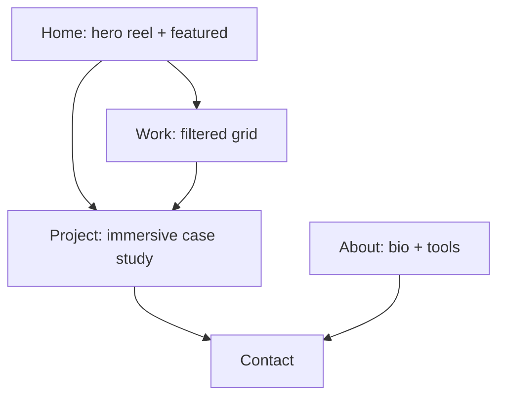

# Griffin Portfolio v1 — Cursor session export

| Field | Value |
|-------|-------|
| Session ID | `09eb1208-d398-4e44-b0be-7ce4997af205` |
| Exported | 2026-06-24 |
| Source | Cursor agent transcript (JSONL → Markdown) |
| PR | https://github.com/funkatron/griffin-portfolio/pull/1 (merged) |
| Live site | https://funkatron.github.io/griffin-portfolio/ |
| Messages | 251 |

Covers: v1 build, review fixes, Node 24, GitHub Pages deploy, asset path fix (`pathWithBase` in OptimizedImage), auto-deploy on push to `main`.

Tool calls are summarized inline; full tool payloads live in the JSONL source.

---

## User (1)

<user_query>
/ask let's brainstorm a portfolio web site for 3d rendered artworks
</user_query>

---

## Assistant (2)

Exploring the workspace for existing portfolio context, then we'll brainstorm a 3D art portfolio site.

[REDACTED]

> *[Glob invoked]*

> *[Read invoked]*

---

## Assistant (3)

A portfolio for 3D work has a different job than a flat design or photography site: the art is dimensional, often cinematic, and sometimes interactive. Below is a structured brainstorm you can react to, trim, or push back on.

---

## What the site should do (in one sentence)

**Make each piece feel like an object or scene you can step into**, not a thumbnail in a grid.

That usually means: big imagery, controlled motion, and enough context (process, tools, intent) that a client or curator knows what they’re hiring for.

---

## Audience (pick 1–2 primary)

| Audience | What they need | Site bias |
|----------|----------------|-----------|
| **Creative directors / agencies** | Fast scan, clear categories, contact | Strong hero, tight grid, “commercial” reel |
| **Galleries / curators** | Series, statement, credits | Project pages with narrative + stills |
| **Game / film studios** | Pipeline, turnaround, scale | Breakdowns, wireframes, poly counts optional |
| **Collectors / fans** | Mood, editions, prints | Full-bleed, minimal chrome, shop later |

Who is Griffin optimizing for first? That choice drives almost everything else.

---

## Core pages (minimal but complete)

1. **Home** — One strong reel or hero piece + 3–6 featured works + one line of positioning (“architectural visualization,” “character design,” “surreal still life,” etc.).
2. **Work** — Filterable gallery (category, year, client/personal).
3. **Project** — The money page: hero media, short story, image sequence, optional breakdown.
4. **About** — Photo, tools, location, availability, short bio (not a novel).
5. **Contact** — Form or email; optional Calendly for commissions.

Optional later: **Process**, **Press**, **Shop** (prints), **Archive**.

---

## How to show 3D (the fun part)

Mix formats; don’t rely on one:

| Format | Best for | Tradeoff |
|--------|----------|----------|
| **Still renders (WebP/AVIF)** | Hero quality, print-like work | No motion; needs lightbox |
| **Looping video (MP4/WebM)** | Turntables, fluids, lighting | File size; needs poster frame |
| **Image sequences / scroll-driven** | Camera moves through a scene | More build effort, high impact |
| **Embedded 3D (glTF + Three.js / model-viewer)** | Product viz, characters | Heavy on mobile; fallback image required |
| **Before/after slider** | Lighting, comp, sculpt | Great for “how it was made” |

**Rule of thumb:** Home = motion; project pages = stills + one motion clip; mobile = still + tap-to-play video.

---

## Visual direction (3 directions to choose from)

**A — Gallery white cube**  
White/off-black background, huge margins, work is the only color. Think museum site. Works when renders are already bold.

**B — Cinematic dark**  
Near-black UI, subtle grain, slow fades. Feels like a film title sequence. Great for moody/archviz/surreal.

**C — Editorial brutalist**  
Oversized type, asymmetric grid, harsh crops. Good if the work is conceptual and you want “artist” not “vendor.”

You can also hybrid: dark home, light project pages (or the reverse).

---

## UX patterns that work for 3D portfolios

- **Full-viewport project open** — Click work → immersive view, not a cramped modal.
- **Lazy, progressive loading** — Blur-up placeholders; don’t block the whole page on a 4K still.
- **Keyboard nav** — Arrow keys between projects (power users and curators love this).
- **Credits block** on every commercial piece (client, role, tools, year).
- **“View stills” vs “Play reel”** toggle on project pages.
- **No autoplay audio** — Ever.

---

## Information architecture for “Work”

Example filters (don’t use all on day one):

- **Type:** still / animation / interactive  
- **Domain:** character, environment, product, abstract  
- **Context:** client / personal / collaboration  
- **Year**

Start with **3–5 categories max**. Too many filters feels like a DAM system, not a portfolio.

---

## Tech stack (practical options)

**Option 1 — Static + fast (good default)**  
Next.js or Astro + headless CMS (Sanity, Contentful) or MDX for projects. Images via Cloudinary or Imgix. Deploy on Vercel/Netlify.

**Option 2 — Visual-first no-code-ish**  
Framer or Webflow — fastest to a polished layout; 3D embeds are still manual.

**Option 3 — Heavy interactive**  
Next.js + Three.js / React Three Fiber for a few hero scenes; keep the rest static for performance.

**Option 4 — Video-forward**  
Mux or Vimeo for reels; site is mostly a shell around great encoding and posters.

For a solo artist portfolio, **Astro or Next + CMS + optimized images/video** is usually the sweet spot (fast, ownable, not overbuilt).

---

## Content each project should capture (CMS fields)

- Title, year, client (optional), your role  
- 1 hero (image or video)  
- Gallery (6–20 assets)  
- Short description (2–4 sentences)  
- Tools: Blender, Cinema 4D, Octane, etc.  
- Optional: wireframe, clay, lighting pass  
- External link (ArtStation, Behance) if you still cross-post  

---

## Performance & SEO (boring but critical)

- Target **LCP under ~2.5s** on home (compress heroes, use modern formats).  
- **Structured data** (`CreativeWork`) for rich results.  
- **Open Graph** images per project (sharing on LinkedIn/Discord matters).  
- **Accessibility:** alt text on stills, captions on reels, reduced-motion respect (`prefers-reduced-motion` → static image instead of video).

---

## Differentiators (pick one “signature”)

1. **Scroll-through camera path** on the homepage (one scene, parallax).  
2. **Process strip** on every project (blockout → sculpt → lookdev → comp).  
3. **Minimal UI that disappears** — only visible on scroll or hover.  
4. **Sound design** optional reel with mute by default (risky but memorable).  
5. **Series pages** — e.g. “Glass & Stone 2024” as a curated exhibition.

One signature beats five half-done tricks.

---

## Suggested v1 scope (ship in weeks, not months)

| Include | Defer |
|---------|--------|
| Home + Work grid + Project template + About + Contact | Shop, blog, 3D embeds everywhere |
| 8–12 best projects | Full archive |
| One showreel (60–90s) | Multiple reels per category |
| Image optimization pipeline | Custom shader backgrounds |

---

## Open questions for you

Answering these will narrow the design fast:

1. **Primary audience** — clients, galleries, or community?  
2. **Dominant output** — stills, animation, or both?  
3. **Tone** — minimal museum, dark cinematic, or loud editorial?  
4. **Motion appetite** — subtle (fade/hover) or bold (scroll-driven, WebGL hero)?  
5. **Update frequency** — new piece monthly (CMS) or rare overhaul (mostly static)?  
6. **Existing assets** — showreel ready? Square crops for social? Project write-ups?

---

## Rough site map (mermaid)



---

If you share audience, tone, and whether the work is mostly stills or motion, we can go one level deeper next: wireframe the home and project pages, name the categories, and pick a stack for `griffin-portfolio` (the repo folder is empty today, so you’re starting clean).

[REDACTED]

---

## User (4)

<user_query>
Audience: 4, 2

Formats: 1, 2

Visuals: go fo C, hardcore

Stack: 1

Diff: 3, 5 (Astronaut Dreams)

Open Q: 1: community, 2: stills mostly, 3: loud editorial 4: subtle, 5: rare overhaul, 6: about 130 images
</user_query>

---

## Assistant (5)

Your choices line up into one clear site: a **loud editorial brutalist** shell around **full-bleed stills**, with **Astronaut Dreams** as the flagship series and the UI mostly **out of the way**.

---

## Creative brief (locked)

| Dimension | Your pick | What it means in practice |
|-----------|-----------|---------------------------|
| **Audience** | Community + galleries/curators | Shareable, mood-first pages; enough credits and series framing for curators |
| **Media** | Stills + occasional loops | WebP/AVIF heroes; short MP4/WebM only where motion adds something |
| **Look** | C, hardcore editorial | Huge type, harsh crops, asymmetric layout, high contrast — not a soft “artist template” |
| **Stack** | Static + fast | Astro or Next, image CDN, Vercel/Netlify; content in files, not a heavy CMS |
| **Signatures** | Disappearing UI + **Astronaut Dreams** | Chrome hides until needed; one exhibition-style series page |
| **Motion** | Subtle | Fade, slight parallax, hover — no scroll gimmicks or WebGL hero |
| **Cadence** | Rare overhaul | Ship v1 solid; updates are batch drops, not weekly CMS edits |
| **Assets** | ~130 images | Curate hard; site shows ~40–60, not the full archive |

**Tension to embrace:** “Community” wants immersion and share cards; “galleries” want series + credits. Editorial brutalist can do both if **typography carries the voice** and **images stay edge-to-edge**.

---

## Site map (v1)

```
/                     → manifesto + 1 Astronaut Dreams still + enter
/work                 → brutal grid, filter by series/year
/astronaut-dreams     → flagship exhibition (Diff 5)
/work/[slug]          → single piece or small cluster
/about                → bio, tools, statement (short)
/contact              → email / socials
```

No blog, no shop v1. Optional `/archive` later for the other ~70 images.

---

## Astronaut Dreams (flagship series)

Treat it as a **mini exhibition**, not a tag on the grid.

**Page structure:**

1. **Title plate** — full viewport, one word per line: `ASTRONAUT` / `DREAMS`, year range, piece count.
2. **Curator line** — 2–3 sentences: theme, mood, what “dream” means in this work (community hook).
3. **Sequence** — 12–24 best stills, **one per scroll** or **2-column asymmetric** (never uniform 3×3).
4. **Process strip** (Diff 3) — 4–6 stills per *representative* piece only: blockout → sculpt → lookdev → comp (not on every image site-wide).
5. **Colophon** — tools, render engine, dimensions if prints matter, “selected works from N total.”

**Grid elsewhere:** Astronaut Dreams pieces get a visual badge or sit in a dedicated row on `/work` so the series reads as a body of work, not scattered singles.

---

## How to handle 130 images

Don’t publish all 130 on v1.

| Bucket | Count (suggested) | Where |
|--------|-------------------|--------|
| **Astronaut Dreams** | 15–25 | Series page + linked project pages |
| **Featured elsewhere** | 15–25 | `/work` grid |
| **Secondary / pairs** | 10–15 | Project pages (variants, detail crops) |
| **Hold** | ~65–90 | Local archive; `/archive` or “Vol. 2” drop later |

**Selection rule:** If two images are 90% the same framing, ship one. Editorial sites feel intentional when **absence** is part of the design.

**File naming** (helps rare overhauls):

```
astronaut-dreams/
  001-hero-floating-habitat.webp
  002-detail-visor.webp
  ...
meta: title, year, series, tags, alt, og crop
```

MDX or YAML frontmatter per piece works well with “rare overhaul” — no CMS subscription for 2–4 updates a year.

---

## Visual system (C, hardcore)

**Typography**

- Display: one compressed or extended grotesk (e.g. Druk, Monument, or similar) at **clamp(4rem, 12vw, 14rem)**.
- Body: neutral grotesk, small, lots of tracking on labels (`YEAR — SERIES — 01/24`).

**Layout**

- Break the grid on purpose: image bleeds left, type crashes into the margin, captions rotated 90° on desktop.
- **Harsh crops** in thumbnails (center-weighted) so the grid feels designed, not dumped.
- White or off-white background with **black type** reads more “editorial poster” than dark cinematic — fits stills and share previews.

**Disappearing UI (Diff 3)**

- Nav: hidden by default; **corner mark** or **thin top rule** on scroll or after first interaction.
- Project view: full-bleed image; title/credits **bottom-left overlay** on hover or tap (mobile: tap once to reveal).
- `prefers-reduced-motion`: no fades; instant show/hide.

**Subtle motion (Q4)**

- 200–400ms opacity on route change.
- Optional 1–2% image parallax on Astronaut Dreams sequence (CSS only).
- Video: **click-to-play** loops only; poster frame = best still.

---

## Formats in practice

| Use case | Format |
|----------|--------|
| Grid thumbs | WebP/AVIF ~800px wide |
| Project hero | 1920–2560px WebP/AVIF |
| Lightbox | Same hero or +1 step resolution |
| OG / social | Fixed 1200×630 crop per series + per hero piece |
| Motion (sparse) | 10–15s loop, muted, &lt;5MB, WebM + MP4 fallback |

Skip glTF / Three.js for v1 — stills-first + rare loops matches your answers.

---

## Stack detail (Option 1, tuned to you)

**Recommendation: Astro** over Next for this project.

- Mostly static pages, image-heavy, rare updates → Astro’s zero-JS default fits.
- Content: **MDX collections** or `content/` folder with frontmatter (no Sanity unless you want a UI for a non-technical editor).
- Images: **Astro `<Image>`** or Cloudinary for auto WebP/AVIF + blur placeholders.
- Deploy: Vercel or Netlify.
- Search: optional Pagefind (static) if the archive grows.

**Content model (minimal)**

```yaml
# per piece
title:
series: astronaut-dreams | other
year:
slug:
hero: path
gallery: [paths]
process: [paths]  # optional, 4-6 max
tools: [blender, ...]
alt:
featured: true|false
```

One `astronaut-dreams.mdx` for series essay + ordered `gallery` list.

---

## Community + gallery without splitting the site

| Need | Community | Galleries/curators |
|------|-----------|---------------------|
| Share | Per-piece OG image + series OG for Astronaut Dreams | Same |
| Discovery | Strong `/work` filters: series, year | Credits block on every project |
| Voice | Short manifesto on home + series statement | Colophon, edition notes if relevant |
| Depth | Discord/IG link in footer, not mid-gallery | Printable PDF “portfolio sheet” later (optional) |

Community lives in **tone and shareability**; curators get **structure and credits** — same pages, two reading modes.

---

## v1 build order

1. **Design tokens** — type scale, margins, overlay behavior (disappearing UI).
2. **Project template** — one still, caption, next/prev, keyboard arrows.
3. **Astronaut Dreams** — sequence + one process strip example.
4. **Work grid** — 20–30 curated thumbs + series filter.
5. **Home** — one hero still + brutal title + link into series.
6. **Image pipeline** — batch resize/export script for 130 sources → 3 sizes + OG crops.
7. **About / Contact** — minimal.

Defer: archive, shop, video reel page, CMS.

---

## Open decisions (3 small ones)

1. **Astronaut Dreams count on the series page** — 12 (tight gallery) or 24 (full exhibition)?
2. **Home entry** — cold open on one image, or title-only then click “Enter”?
3. **Print/collector angle** — any “available as print” note on series colophon, or purely digital for now?

Answer those and the next step is a **wireframe-level spec** (block order + breakpoints) or an **Astro folder layout + frontmatter schema** you can hand to implementation in Agent mode.

[REDACTED]

---

## User (6)

<user_query>
1: 12; 2: image; 3: purely digital
</user_query>

---

## Assistant (7)

Confirming the repo is still empty, then drafting the implementation plan from your locked creative choices.

[REDACTED]

> *[Glob invoked]*

> *[AskQuestion invoked]*

---

## Assistant (8)

Creating the implementation plan from your locked creative and technical choices.

[REDACTED]

> *[CreatePlan invoked]*

---

## User (9)

<manually_attached_skills>
The user has manually attached the following skills to their message.
These skills contain specific instructions or workflows that the user wants you to follow for this request.
Only read the files if needed, the full skill content is inlined here.

Skill Name: FUNK-start-new-task
Path: /Users/coj/.cursor/skills/FUNK-start-new-task/SKILL.md
SKILL.md content:
# Start a new task (issue → plan)

Use this skill when beginning work from **Linear**, **GitHub** (issue or linked PR), or a **paste** of ticket text.

**Terms (use consistently):** **AC** = acceptance criteria. **Plan** = the markdown deliverable below, not the ticket body unless the user asks to sync.

**Output:** A **planning artifact** for the implementer: grounded in the issue, explicit about unknowns, **three-lens-reviewed**, and **actionable** (next command or decision).

## OODA loop (mandatory spine)

Run **Observe → Orient → Decide → Act**, then **re-Observe** if the issue, branch, or constraints change.

| Phase | In this skill |
|-------|----------------|
| **Observe** | Pull issue text, links, labels, comments, designs, related issues/PRs. List **gaps** (missing AC, unclear actor, no repro) instead of filling them with fiction. |
| **Orient** | Map to users, **risk** (data/UI/auth/PII), and **repo touchpoints**. Classify: bug vs feature vs chore. Note **defaults** the issue is silent on (empty states, permissions, idempotency). |
| **Decide** | Lock stories, AC, **test strategy**, and **one primary** approach (with alternates). Record **open questions** with who/unblocks—not a vague list. |
| **Act** | Deliver the structured plan. If implementation starts, treat the plan as the **working contract**; revise it when scope slips and say what changed in one line. |

**Loop:** If the issue conflicts with the codebase or product rules, return to **Observe** (re-read ticket; **one** targeted question if needed), then update **Orient** and the plan.

## Prerequisites

- **Source of truth:** Issue URL/ID or pasted description. Use **Linear MCP**, **GitHub** (UI/API/`gh`), or paste—whatever the environment allows.
- **Metadata:** Do not invent assignee, sprint, or priority; use values from the tool or mark **Unknown**.
- **Evidence hygiene:** Summarize sensitive or PII-heavy ticket content; do not paste secrets, tokens, or customer data into the plan unless the user explicitly needs them (then minimize).
- **Backward compatibility:** If the user states **BC is not required** (or similar), reflect that in **Orient** and the plan: prefer **cleanup and clarity** over dual code paths, migration chapters, or preserving obsolete defaults unless there is an independent reason (security, data integrity).

## Git — feature branch (before implementation)

Work should land on a **feature branch cut from the repo's default remote branch**, not from an unrelated feature branch. **Prefer `origin/main` when present; otherwise use `origin/master`.**

1. Detect the default branch: prefer `origin/main` when it exists; otherwise use `origin/master`.
2. `git fetch origin <default-branch>`
3. `git checkout -b <branch-name> origin/<default-branch>` — use **`feature/<ISSUE-KEY>-<short-title>`** (canonical shape: `feature/ISSUE-KEY-a-short-title-for-the-branch`; e.g. `feature/WBD-1033-slack-pause-resume`). Do **not** use Linear’s default `username/issue-slug` prefix (e.g. `funkatron/wbd-…`) for **wbd-prototype** unless the user explicitly asks for it.
4. Bring over WIP only if needed: `git stash push -u -m "…"`, switch to the new branch, `git stash pop`; resolve conflicts. Drop **stash-spilled** artifacts that belong to other tickets (e.g. stray `.cursor/plans/*.plan.md`) unless the user wants them on this branch.

**Plan deliverable:** In the **Next step** section, when implementation is the next move, call out the branch name and that it is based on the detected default remote branch (`origin/main` when present, otherwise `origin/master`) (`git merge-base HEAD origin/<default-branch>` equals `origin/<default-branch>` before the first commit).

## Workflow (follow in order)

Copy and track **internally**; the user-facing deliverable is the template (checkboxes there are for **AC**, not this meta-list).

```
Task kickoff (agent checklist):
- [ ] Observe: issue fetched or pasted; Evidence vs Assumptions filled
- [ ] Stories: stated or drafted; each traceable to ticket fields or comments
- [ ] AC: from ticket or proposed; observable; MVP vs follow-up if huge scope
- [ ] Test-first: reds named or "not feasible" with smallest substitute
- [ ] Solution: primary + alternates; spikes time-boxed if any
- [ ] Three-lens pass completed; plan revised once
- [ ] Git (when implementation follows): feature branch from the detected default remote branch (`origin/main` when present, otherwise `origin/master`), named `feature/<ISSUE-KEY>-<short-title>`; branch name recorded in **Next step**
- [ ] Next step: one concrete action (command, decision, or question owner)
```

### 1. Observe — Ingest the issue

- Collect: title, description, comments, AC, designs, **blocks/relations**, linked PRs.
- **Evidence vs Assumptions**
  - **Evidence:** Bullet quotes or pointers (e.g. *Description para 2*, *comment by X*)—not "the ticket implies."
  - **Assumptions:** Short bullets; every assumption is fair game for **Open questions** if it could change the approach.
- **Thin intake:** If the issue is empty or ambiguous, deliver **draft** stories, **draft** AC, and **1–3 blocker questions**. Do **not** imply certainty; label the plan **Draft — blocked on answers**.

### 2. User stor(y/ies) — Get or create

**Stated:** If the ticket already has *As a / I want / So that* (or team equivalent), quote verbatim and cite location (description, field name).

**Created:** If missing, derive **one or more** stories from title, description, and discussion:

- Use **real roles**. Label **Technical story** when the main beneficiary is maintainers, integrations, or operators—not an end user.
- Split when **value streams** differ (e.g. subscriber UX vs admin vs API partner).
- **So that** ties to **observable** outcomes—not vanity metrics unless the ticket sources them.

Do **not** fabricate user research or numbers.

### 3. Acceptance criteria — Get or create

**From ticket:** Quote or list existing AC; note origin (*from issue description*).

**Create if missing:** Observable, testable items (Given/When/Then or checklist):

- Outcomes: UI behavior, API contracts, data rules, non-regression.
- Add a11y/perf/i18n **only** if the issue or repo standard requires them—otherwise list under **Follow-ups** with reason.

Avoid "works well" / "performant" without **how we know** (automated test name, metric threshold, or numbered manual check).

**Large scope:** **MVP AC** vs **Follow-ups** with one-line cut-line rationale.

### 4. Test-first plan (default: Yes)

**Feasible** when the repo has a harness for this layer (PHPUnit, Vitest, Dusk, etc.): name **test file or case** you expect to add/extend and the **assertion** tied to each MVP AC—behavior, not private methods.

**Not feasible** when: spike-only, no harness, or environment-only validation—state **why**, then give the **smallest** substitute (characterization test, contract test, scripted API check, **numbered** manual protocol).

**Order:** Red → green → refactor against the **thinnest** slice that satisfies the first MVP AC.

### 5. Solution options — First pass

Deliver **1 primary** and **1–2 alternates** (or **No safe alternate** with why):

- **Approach:** Modules, routes, DB, queues, flags, external deps.
- **Tradeoffs:** Coupling, rollout, migrations, perf, **consistency with existing patterns**.
- **Why primary wins:** One tight paragraph for **this repo** and this issue—not generic engineering.
- **Spikes:** Only when picking requires discovery; **time-box** (e.g. *≤2h: prove X in branch*).

### 6. Three-lens review (mandatory before delivering the plan)

Draft the plan **once**, then revise in **three passes**. **Fold edits into the final plan**; optionally add **Appendix — Review highlights** (residual risks only). Do not ship the first draft untouched.

#### 6a. Devil's advocate

- **Wrong problem:** Issue title vs described pain; assumptions sold as facts—demote to Assumptions or Open questions.
- **Hidden scope:** Migrations, backfills, dual-write, feature flags, i18n, email/notifications, **permissions matrices**, admin toggles.
- **Happy-path bias:** List **failure modes**: authz, empty/partial data, concurrency, timeouts, **silent defaults** (what happens if field absent).
- **AC quality:** Vague or subjective criteria—tighten or move to Open questions with verifier.
- **Evidence:** Stories or AC with no ticket anchor—mark *Inferred* or add cite.

#### 6b. Expert technical writer

- **Scan:** Same vocabulary throughout (issue vs ticket vs story); define unusual domain terms **once**.
- **Traceability:** Each MVP AC maps to a **test name**, **assertion**, or **numbered manual step**—no orphan criteria.
- **Honest gaps:** *Unknown* rows need **who** unblocks or **what** experiment decides—not "TBD" alone.
- **No decorative code:** Do not fence example code in the plan unless it is real repository shape or labeled **pseudo**.
- **Whitespace / scanability (mandatory for the delivered plan body):** Dense plans get mis-implemented. After the three-lens pass, **re-format** the markdown for human readers:
  - **One idea per paragraph**; break walls of text.
  - Use **`---` horizontal rules** or **double blank lines** between major sections (`Source`, stories, AC, tests, solution, open questions, next step, appendix).
  - Under **Evidence vs assumptions**, split **Evidence** into sub-blocks (e.g. *Staged*, *Unstaged*, *Repo state*) instead of one long bullet.
  - Separate **MVP** vs **Follow-up** AC with blank lines; use a **small table** for AC → verification mapping when there are ≥3 checks.
  - **Number** open questions when order matters; keep **Next step** to one short paragraph.
  - Optional one-line **intent blurb** directly under `# Task:` so the goal is obvious before the first section.

**ADHD / cognitive load (same lens):** The plan should answer **“what do I do next?”** in under a minute of skimming. Prefer:

- **TL;DR** at the top (3–5 bullets: problem, fix, main file or layer, explicit **out of scope**).
- **Quickstart** — **before** any task-routing table: the shortest executable path (e.g. branch/checkout, first failing test or smoke command, first file to touch). One tight numbered block beats burying this in prose.
- **How do I…** (task routing) — small table **after** quickstart: e.g. *How do I only implement? → …* / *How do I get context on X? → …* so readers jump to one section.
- **At a glance** — one table for ticket, branch, schedule, or other **constants** implementers grep for.
- **Single execution path** — one numbered or checkbox **Implementation checklist** (branch → tests → code → verify); do not bury order-only steps in prose.
- **Tables over walls** — AC as scannable columns (**What must be true** / **How we verify**); alternatives and asymmetry as **small tables** (few columns, short cells).
- **Section breaks** — `---` between major blocks; **bold** the first few words of important bullets.
- **Appendix** — if present, label **optional** and one line *skip if you’re executing from the checklist* so implementers are not forced through meta-review first.

These patterns are for **internal** plans and handoffs. Do **not** paste three-lens **role-play** or internal review blocks into **user-facing** docs—see **`three-lens-external-docs`** workspace rule.

#### 6c. Senior staff engineer

- **Operability:** Rollout/rollback, feature flags, **observability** (logs/metrics/alerts) if production touch—*N/A* with reason if truly local-only.
- **Data integrity:** Migration order, idempotency, **partial failure** (retry?, DLQ?), audit if regulated or money-adjacent.
- **Boundaries:** Tests at **integration** seams vs mocks-only; contract with other services/teams.
- **Multi-ticket / epic:** If work spans issues, list **in-scope IDs** and **explicitly excluded** items to prevent scope bleed.

**Deliverable:** The **revised** plan body (and optional **Appendix — Review highlights**).

## Output structure (use this template)

```markdown
# Task: [issue key — title]

[Optional: one-sentence intent so the reader knows the outcome before details.]

## Source
- Link / ID:
- Evidence vs assumptions:
  - Evidence: …
  - Assumptions: …

## User stor(y/ies)
- …

## Acceptance criteria
- [ ] … (MVP)
- [ ] … (Follow-up — …)

## Test-first plan
- Feasibility: Yes / No — …
- Reds / cases / manual steps mapped to AC: …

## Solution
- Primary:
- Alternatives:
- Why primary:
- Spikes (if any): …

## Open questions / blockers
- …

## Next step
- …

## Appendix — Review optional highlights
- …
```

## Tooling hints (non-prescriptive)

- **Linear:** Read/update via MCP when available—**ask** before mutating ticket fields or comments.
- **GitHub:** Read issue and linked PRs; `gh issue view` / `gh pr view` when CLI is present.
- **PR descriptions:** When creating or updating a PR body, follow **FUNK-what-we-did** → *GitHub pull request description*: **TL;DR** first, then **Need**, **Changes**, **Why (optional)** — chunked, bold labels, skimmable (see skill for ADHD-friendly formatting).
- **Architecture:** Link internal docs in **Orient**; do not paste long excerpts.

## Quality bar

- **Grounded:** Stories and AC trace to Evidence or are labeled **Inferred**.
- **Test-linked:** MVP ACs have a verification path.
- **Reviewed:** Survived all three lenses; contradictions resolved in the body.
- **Next action:** One concrete step, not "start coding" alone.

## Relationship to other skills

- After shipping, use **FUNK-what-we-did** (or team equivalent) for the delivery narrative. This skill ends at an **approved or draft-blocked plan**, not implementation history.
</manually_attached_skills>
<user_query>
/FUNK-start-new-task I would like to start this. we don't have an issue, but we have the existing plan. let's rewrite and restructure using our approach from the skill
</user_query>

---

## Assistant (10)

Rewriting the plan with the FUNK-start-new-task structure. Reading the existing plan and repo state first.

[REDACTED]

> *[Read invoked]*

> *[Shell invoked]*

---

## Assistant (11)

[REDACTED]

> *[Glob invoked]*

---

## Assistant (12)

[REDACTED]

> *[Glob invoked]*

> *[Glob invoked]*

---

## Assistant (13)

[REDACTED]

> *[Read invoked]*

---

## Assistant (14)

Rewriting the plan into the FUNK-start-new-task structure: OODA grounding, user stories, test-linked AC, and a single implementation checklist.

[REDACTED]

> *[Write invoked]*

---

## Assistant (15)

The plan is rewritten in FUNK-start-new-task shape at [`.cursor/plans/griffin_portfolio_v1_34fee3c5.plan.md`](.cursor/plans/griffin_portfolio_v1_34fee3c5.plan.md).

---

## What changed

**Structure** — Matches the skill template: Source (evidence vs assumptions), user stories, MVP vs follow-up AC, test-first plan, solution with alternates, open questions, next step, optional appendix.

**Skimmability** — TL;DR and **Quickstart** up front; **How do I…** routing table; **At a glance** constants; **AC → verification** table; single **Implementation checklist** (12 steps).

**Grounding** — No ticket, so source is the brainstorm + your answers. Repo evidence: not a git repo yet, only the plan file exists.

**Git** — Added checklist item 1: `git init` + branch `feature/portfolio-v1-astro` (no remote/default branch until you add one).

**Tests** — Marked **not feasible** for a harness; replaced with a **6-step manual smoke protocol** mapped to each AC. Optional Vitest contract test noted as defer.

**Three-lens** — Folded into the body (Zod validation, empty filter state, no 130-image scope creep) and a short **Appendix — Review highlights** you can skip when executing.

**Todos** — Added `git-init-branch`; other items unchanged.

---

## Next step (from the plan)

Initialize git, scaffold Astro on `feature/portfolio-v1-astro`, then `src/content/config.ts` + seed MDX.

To start building, switch to **Agent mode** and say **“implement the plan”** or **“start checklist item 1”**.

[REDACTED]

---

## User (16)

<user_query>
Task: portfolio-v1 — Griffin 3D portfolio (Astro)

Implement the plan as specified, it is attached for your reference. Do NOT edit the plan file itself.

To-do's from the plan have already been created. Do not create them again. Mark them as in_progress as you work, starting with the first one. Don't stop until you have completed all the to-dos.
</user_query>

---

## Assistant (17)

Implementing the plan from checklist item 1: initializing git and scaffolding Astro.

[REDACTED]

> *[TodoWrite invoked]*

> *[Glob invoked]*

---

## Assistant (18)

[REDACTED]

> *[Shell invoked]*

---

## Assistant (19)

[REDACTED]

> *[Shell invoked]*

---

## Assistant (20)

[REDACTED]

> *[Shell invoked]*

---

## Assistant (21)

[REDACTED]

> *[Read invoked]*

---

## Assistant (22)

[REDACTED]

> *[Shell invoked]*

---

## Assistant (23)

[REDACTED]

> *[Shell invoked]*

---

## Assistant (24)

[REDACTED]

> *[Shell invoked]*

---

## Assistant (25)

[REDACTED]

> *[Shell invoked]*

> *[Read invoked]*

> *[Read invoked]*

> *[Read invoked]*

---

## Assistant (26)

[REDACTED]

> *[TodoWrite invoked]*

> *[StrReplace invoked]*

---

## Assistant (27)

Creating core infrastructure: content schema, styles, utilities, and placeholder assets.

[REDACTED]

> *[Write invoked]*

> *[Write invoked]*

> *[Write invoked]*

> *[Write invoked]*

> *[Write invoked]*

---

## Assistant (28)

[REDACTED]

> *[Shell invoked]*

> *[Write invoked]*

> *[Write invoked]*

> *[Write invoked]*

---

## Assistant (29)

[REDACTED]

> *[Write invoked]*

> *[Write invoked]*

> *[Write invoked]*

> *[Write invoked]*

> *[Write invoked]*

> *[Write invoked]*

---

## Assistant (30)

[REDACTED]

> *[Write invoked]*

> *[Write invoked]*

> *[Write invoked]*

> *[Write invoked]*

> *[Write invoked]*

> *[Write invoked]*

> *[Write invoked]*

> *[Shell invoked]*

---

## Assistant (31)

[REDACTED]

> *[StrReplace invoked]*

> *[StrReplace invoked]*

> *[Write invoked]*

> *[Write invoked]*

> *[Write invoked]*

> *[Write invoked]*

> *[Write invoked]*

> *[Write invoked]*

---

## Assistant (32)

[REDACTED]

> *[StrReplace invoked]*

> *[StrReplace invoked]*

> *[StrReplace invoked]*

> *[StrReplace invoked]*

> *[StrReplace invoked]*

> *[Write invoked]*

> *[Write invoked]*

---

## Assistant (33)

[REDACTED]

> *[Shell invoked]*

> *[Grep invoked]*

---

## Assistant (34)

[REDACTED]

> *[Grep invoked]*

> *[WebSearch invoked]*

---

## Assistant (35)

[REDACTED]

> *[Delete invoked]*

> *[Write invoked]*

---

## Assistant (36)

[REDACTED]

> *[Shell invoked]*

---

## Assistant (37)

[REDACTED]

> *[Grep invoked]*

> *[Shell invoked]*

---

## Assistant (38)

[REDACTED]

> *[Glob invoked]*

---

## Assistant (39)

[REDACTED]

> *[Read invoked]*

---

## Assistant (40)

[REDACTED]

> *[Read invoked]*

---

## Assistant (41)

Replacing `slug` with `id` for Astro 6 content entries and fixing the commerce-copy grep false positive.

[REDACTED]

> *[StrReplace invoked]*

> *[StrReplace invoked]*

> *[StrReplace invoked]*

> *[StrReplace invoked]*

> *[StrReplace invoked]*

> *[StrReplace invoked]*

> *[StrReplace invoked]*

> *[StrReplace invoked]*

> *[StrReplace invoked]*

> *[StrReplace invoked]*

> *[StrReplace invoked]*

---

## Assistant (42)

[REDACTED]

> *[Shell invoked]*

---

## Assistant (43)

[REDACTED]

> *[Grep invoked]*

> *[Read invoked]*

> *[SetActiveBranch invoked]*

---

## Assistant (44)

[REDACTED]

> *[StrReplace invoked]*

> *[StrReplace invoked]*

> *[TodoWrite invoked]*

> *[Shell invoked]*

---

## Assistant (45)

[REDACTED]

> *[Await invoked]*

---

## Assistant (46)

[REDACTED]

> *[Shell invoked]*

---

## Assistant (47)

[REDACTED]

> *[Shell invoked]*

---

## Assistant (48)

[REDACTED]

> *[Shell invoked]*

---

## Assistant (49)

Portfolio v1 is implemented on branch `feature/portfolio-v1-astro`. Summary:

## What shipped

**Stack:** Astro 6 + MDX + TypeScript, Astro 6 content layer (`src/content.config.ts` with `glob` loaders), Node 22 (`.nvmrc`).

**Routes (32 pages built):**
- `/` — cold-open full-bleed hero (Astronaut Dreams #1)
- `/astronaut-dreams` — 12-piece exhibition, process strip, digital colophon
- `/work` — asymmetric grid, 27 featured works, `?series=` / `?year=` filters
- `/work/[slug]` — hero, credits overlay (hover/tap), optional process strip, `←`/`→` nav, JSON-LD
- `/about`, `/contact`

**Design:** Editorial brutalist tokens, disappearing nav (scroll / pointer-to-top), `prefers-reduced-motion` respected.

**Content:** 12 `astronaut-dreams` + 15 `other` MDX pieces, series metadata, 41 SVG placeholders in `public/placeholders/`.

**Tooling:** `scripts/generate-placeholders.mjs`, `scripts/prepare-images.mjs`, `scripts/seed-content.mjs`, task-first `README.md`.

## Run it

```bash
cd /Users/coj/src/griffin-portfolio
nvm use
npm run dev
```

Build verified: `npm run build` exits 0; preview returns 200 for `/`, `/astronaut-dreams`, `/work`.

## Notable details

- Astro 6 uses entry `id` (not `slug`) — URLs like `/work/astronaut-dreams-01`.
- Real renders: drop files in `sources/`, install `sharp`, run `node scripts/prepare-images.mjs`, update frontmatter paths.
- Git is initialized on `feature/portfolio-v1-astro` but **not committed** — say if you want an initial commit.

[REDACTED]

---

## User (50)

<user_query>
Implement the plan as specified, it is attached for your reference. Do NOT edit the plan file itself.

To-do's from the plan have already been created. Do not create them again. Mark them as in_progress as you work, starting with the first one. Don't stop until you have completed all the to-dos.
</user_query>

---

## User (51)

[Image]
<image_files>
The following images were provided by the user and saved to the workspace for future use:
1. /Users/coj/.cursor/projects/Users-coj-src-griffin-portfolio/assets/generative_growth-f4391791-258d-45f1-ad12-bfe9e5a22b8e.png

These images can be copied for use in other locations.
</image_files>
<user_query>
use this for splash
</user_query>

---

## Assistant (52)

Setting the provided image as the home splash hero. Checking the current home page and asset setup.

[REDACTED]

> *[Read invoked]*

> *[Glob invoked]*

---

## Assistant (53)

[REDACTED]

> *[Shell invoked]*

---

## Assistant (54)

[REDACTED]

> *[Shell invoked]*

> *[Write invoked]*

---

## Assistant (55)

[REDACTED]

> *[StrReplace invoked]*

> *[Shell invoked]*

---

## Assistant (56)

The home splash now uses your image.

**Changes:**
- Copied the asset to `public/images/splash.jpg` (the file is JPEG data)
- Updated `src/pages/index.astro` to use it as the full-bleed hero instead of the Astronaut Dreams placeholder
- Set `object-position: 42% 58%` so the crystalline form stays centered in the crop
- OG image on home now points at the same splash

Run `npm run dev` and open `/` to see it. If you want it tighter or looser in frame, we can tweak the object position.

[REDACTED]

---

## User (57)

[Image]
[Image]
[Image]
[Image]
[Image]
[Image]
[Image]
[Image]
[Image]
[Image]
[Image]
[Image]
[Image]
[Image]
<image_files>
The following images were provided by the user and saved to the workspace for future use:
1. /Users/coj/.cursor/projects/Users-coj-src-griffin-portfolio/assets/anotherastronaught-dfd2c266-e45a-48c6-b292-824fe735a782.png
2. /Users/coj/.cursor/projects/Users-coj-src-griffin-portfolio/assets/eevee_next_cave-64f0e237-74d2-4484-a92e-e445e1fad790.png
3. /Users/coj/.cursor/projects/Users-coj-src-griffin-portfolio/assets/non_dustty-3f982e7f-9214-4a41-ba23-2fa82454fdf6.png
4. /Users/coj/.cursor/projects/Users-coj-src-griffin-portfolio/assets/cloud_space_man-005826f5-fc82-4df3-aa30-216d746035a5.png
5. /Users/coj/.cursor/projects/Users-coj-src-griffin-portfolio/assets/spacemanincave-b4df487b-71ae-420d-8e07-f87a90cc1066.png
6. /Users/coj/.cursor/projects/Users-coj-src-griffin-portfolio/assets/astroroom2-dfef5556-30d2-4d7a-b152-8e54c8e5d6ac.png
7. /Users/coj/.cursor/projects/Users-coj-src-griffin-portfolio/assets/religionpart2-2aaf1f0c-250c-423c-ba32-6208e144c335.png
8. /Users/coj/.cursor/projects/Users-coj-src-griffin-portfolio/assets/spaceman-b799a98a-2e6b-4e9a-8bb1-dd2d8acfe0b1.png
9. /Users/coj/.cursor/projects/Users-coj-src-griffin-portfolio/assets/moodycity-64488a0c-b7ea-474e-a3ed-d7de5cc333e4.png
10. /Users/coj/.cursor/projects/Users-coj-src-griffin-portfolio/assets/IMG_9943-66257b6e-ef62-4ddf-b7e4-23a0070bcce5.png
11. /Users/coj/.cursor/projects/Users-coj-src-griffin-portfolio/assets/untitled-32f20646-0212-4685-ac75-5533a233674d.png
12. /Users/coj/.cursor/projects/Users-coj-src-griffin-portfolio/assets/spacemaninwater-f3db55d8-0a5c-42eb-b149-c271973bf67f.png
13. /Users/coj/.cursor/projects/Users-coj-src-griffin-portfolio/assets/smallman-8fca8063-223b-4a45-8af6-5820f4e1248a.png
14. /Users/coj/.cursor/projects/Users-coj-src-griffin-portfolio/assets/generative_growth-160f1cfe-1cec-49e0-9ecb-b3dc082d4660.png

These images can be copied for use in other locations.
</image_files>
<user_query>
a bunch of images, use as appropriate
</user_query>

---

## Assistant (58)

Mapping the 14 renders to the site: copying assets, then updating the splash, Astronaut Dreams series, and other featured pieces.

[REDACTED]

> *[Shell invoked]*

> *[Glob invoked]*

---

## Assistant (59)

[REDACTED]

> *[Write invoked]*

---

## Assistant (60)

[REDACTED]

> *[StrReplace invoked]*

> *[StrReplace invoked]*

> *[StrReplace invoked]*

> *[Shell invoked]*

---

## Assistant (61)

[REDACTED]

> *[Shell invoked]*

> *[Read invoked]*

> *[Read invoked]*

---

## Assistant (62)

[REDACTED]

> *[StrReplace invoked]*

> *[StrReplace invoked]*

---

## Assistant (63)

All 14 renders are wired in. Here’s how they’re used:

## Placement

| Location | Image |
|----------|--------|
| **Home splash** | `Generative Growth` — abstract crystalline form |
| **Astronaut Dreams (12)** | All astronaut / atmospheric pieces, retitled to match |
| **Other work (2)** | `Generative Growth`, `Sacred Geometry` (religionpart2) |
| **Other 03–15** | Still placeholders until more assets arrive |

## Astronaut Dreams sequence

1. Cliffside Watch — cliff overlook  
2. Earth in Visor — B&W helmet  
3. Cloud Harbor — helmet in ocean under cloud  
4. Dust Wake — desert dunes  
5. Abandoned Chamber — helmet in sunlit room (+ **process strip** using 6 renders)  
6. Red Halo — shrouded figure  
7. Golden Horizon — sunset silhouette  
8. Cave Threshold — cave frame  
9. Open Water — astronaut in ocean  
10. Gothic Portal — stone arch  
11. Violet Architecture — purple megastructure  
12. Submerged Tower — dystopian tower  

## Files

- Renders: `public/works/*.jpg`
- Splash: `public/images/splash.jpg`
- Content updated in `src/content/pieces/` and `src/content/series/astronaut-dreams.mdx`
- Re-run anytime: `npm run apply:assets`

`npm run build` passes. Run `npm run dev` to review — the grid will mix 14 real works with 13 placeholders until you add more.

[REDACTED]

---

## User (64)

<user_query>
give it a kanawagadragon theme
</user_query>

---

## Assistant (65)

Searching for what the kanawagadragon theme refers to in your project and elsewhere.

[REDACTED]

> *[Grep invoked]*

> *[WebSearch invoked]*

---

## Assistant (66)

[REDACTED]

> *[WebFetch invoked]*

> *[Read invoked]*

> *[Read invoked]*

> *[Read invoked]*

---

## Assistant (67)

[REDACTED]

> *[WebFetch invoked]*

> *[Read invoked]*

> *[Read invoked]*

> *[Read invoked]*

---

## Assistant (68)

[REDACTED]

> *[WebFetch invoked]*

> *[Grep invoked]*

---

## Assistant (69)

Applying the Kanagawa Dragon palette (muted dark, warm ink tones, dragon accents) across tokens, typography, and components.

[REDACTED]

> *[Write invoked]*

> *[Write invoked]*

> *[StrReplace invoked]*

> *[StrReplace invoked]*

> *[StrReplace invoked]*

> *[StrReplace invoked]*

> *[StrReplace invoked]*

> *[Read invoked]*

> *[Read invoked]*

---

## Assistant (70)

[REDACTED]

> *[StrReplace invoked]*

> *[StrReplace invoked]*

> *[StrReplace invoked]*

> *[StrReplace invoked]*

> *[Write invoked]*

> *[StrReplace invoked]*

> *[StrReplace invoked]*

---

## Assistant (71)

[REDACTED]

> *[StrReplace invoked]*

> *[StrReplace invoked]*

> *[Shell invoked]*

---

## Assistant (72)

The site now uses **Kanagawa Dragon** — the muted, late-night dark variant from [kanagawa.nvim](https://github.com/rebelot/kanagawa.nvim) (Hokusai-inspired palette).

## What changed

**Colors** (`src/styles/tokens.css`)
- Backgrounds: `dragonBlack` ink tones (`#12120f`, `#1d1c19`)
- Text: `dragonWhite` / `dragonGray`
- Accents: `dragonRed`, `dragonAqua`, `dragonYellow`, `dragonTeal`, `dragonViolet`

**Atmosphere** (`src/styles/kanagawa.css`)
- Subtle radial washes (aqua top-right, red bottom-left) over a dark gradient
- Warm first-letter highlight on display titles
- Active filters/nav in red + yellow
- Series index labels in `dragonYellow`

**Typography**
- Display: **Cormorant Garamond** (editorial serif)
- Body/labels: **Noto Sans JP** (light Japanese influence)

**Components**
- Nav: dark glass bar, warm active state
- Grid: dark frames, red series stripe, white overlay text
- Credits overlay: dragon ink gradient
- Favicon: wave motif in dragon red/aqua/gold

Run `npm run dev` to preview. If you want **Kanagawa Wave** (higher contrast) or **Lotus** (light) instead, say which variant and we can swap the token set.

[REDACTED]

---

## User (73)

Stage the changes you worked on, commit, and push for this branch.
- Current branch: feature/portfolio-v1-astro.
- Base branch: main.
- Stage the changes you worked on.
- If there are unrelated files or changes, exclude them.
- Write a concise commit message.
- Push after creating the commit.
- Do not include unrelated files in the commit.
<user_query>
Execute the selected diff-tab commit-and-push action.
</user_query>

---

## Assistant (74)

[REDACTED]

> *[Shell invoked]*

> *[Shell invoked]*

---

## Assistant (75)

[REDACTED]

> *[Read invoked]*

> *[Shell invoked]*

---

## Assistant (76)

[REDACTED]

> *[Shell invoked]*

---

## Assistant (77)

[REDACTED]

> *[Shell invoked]*

---

## Assistant (78)

[REDACTED]

> *[Shell invoked]*

---

## Assistant (79)

[REDACTED]

> *[Shell invoked]*

---

## Assistant (80)

[REDACTED]

> *[Shell invoked]*

---

## Assistant (81)

[REDACTED]

> *[Shell invoked]*

---

## Assistant (82)

[REDACTED]

> *[Shell invoked]*

---

## Assistant (83)

Committed and pushed on `feature/portfolio-v1-astro`.

**Commit:** `06c4e72` — *Add Griffin 3D portfolio v1 on Astro with Kanagawa Dragon theme.*

**Included:** 124 files (Astro site, content, real renders, scripts, Kanagawa Dragon styling)  
**Excluded:** `.cursor/` (local plan files)

**Remote:** Created and pushed to `origin` (no remote existed before).

- **Repo:** https://github.com/funkatron/griffin-portfolio  
- **Branch:** https://github.com/funkatron/griffin-portfolio/tree/feature/portfolio-v1-astro  
- **Commit:** https://github.com/funkatron/griffin-portfolio/commit/06c4e721277d236136011c281e3e9fcc42323500  

`main` does not exist on the remote yet — only `feature/portfolio-v1-astro` was pushed. Open a PR into `main` when you’re ready to merge.

[REDACTED]

---

## User (84)

<subagent_delegation_context>
The user has indicated they want you to delegate work to the following subagent(s): FUNK-what-we-did-subagent

To delegate, call the Task tool with the subagent_type parameter. Example:
Task(subagent_type="FUNK-what-we-did-subagent", prompt="your detailed task description")
</subagent_delegation_context>
<user_query>
open PR, and write a desc for PR based on /FUNK-what-we-did-subagent
</user_query>

---

## Assistant (85)

[REDACTED]

> *[Read invoked]*

> *[Shell invoked]*

---

## Assistant (86)

[REDACTED]

> *[Shell invoked]*

> *[Task invoked]*

---

## Assistant (87)

[REDACTED]

> *[Shell invoked]*

---

## Assistant (88)

Creating `main` on the remote so we can open the PR.

[REDACTED]

> *[Shell invoked]*

---

## Assistant (89)

[REDACTED]

> *[Shell invoked]*

---

## Assistant (90)

[REDACTED]

> *[Shell invoked]*

---

## Assistant (91)

[REDACTED]

> *[Shell invoked]*

---

## Assistant (92)

Fixing unrelated branch histories so GitHub can open the PR.

[REDACTED]

> *[Shell invoked]*

---

## Assistant (93)

[REDACTED]

> *[Shell invoked]*

---

## Assistant (94)

PR is open: **https://github.com/funkatron/griffin-portfolio/pull/1**

**Title:** Add Griffin 3D portfolio v1 (Astro + Kanagawa Dragon)

The description follows the FUNK-what-we-did PR format (TL;DR → Need → Changes → Why → AC → Test plan).

**Note:** `main` didn’t exist when the repo was created, so I added an empty root commit on `main` and rebased `feature/portfolio-v1-astro` onto it so GitHub could open the PR. The feature branch was force-pushed; the portfolio commit is now `beed3d3` (same content as before).

[REDACTED]

---

## User (95)

<user_query>
ensure we have aq great handoff doc AND a great dev X quickstart/howto info. be an expert on writing great tech documentation
</user_query>

---

## Assistant (96)

Reviewing current docs and project structure, then drafting a handoff doc and a developer quickstart/how-to.

[REDACTED]

> *[Read invoked]*

> *[Read invoked]*

> *[Read invoked]*

> *[Glob invoked]*

---

## Assistant (97)

[REDACTED]

> *[Read invoked]*

> *[Read invoked]*

> *[Read invoked]*

---

## Assistant (98)

Writing a task-first README and two deeper docs: a developer guide and a delivery handoff.

[REDACTED]

> *[Write invoked]*

> *[Write invoked]*

> *[Write invoked]*

---

## Assistant (99)

Documentation is split into three layers:

## 1. [README.md](README.md) — front door
- What the project is + links to deeper docs
- Requirements (Node 22)
- **Quickstart** — one copy-paste sequence with a short “what each step does”
- Task routing table → `DEVELOPMENT.md` / handoff
- npm scripts + routes at a glance
- No duplicate how-tos (points downward)

## 2. [docs/DEVELOPMENT.md](docs/DEVELOPMENT.md) — developer how-to
- **How do I…** routing table
- Project layout with paths explained
- **Content schema** tables (pieces + series, every field)
- Step-by-step: add piece, edit series, replace images (fast + batch), home hero, theme
- Scripts reference with outcomes
- Troubleshooting (Astro 6 loaders, `id` vs slug, filters, 404s)
- Verification checklist

## 3. [docs/delivery/portfolio-v1-handoff.md](docs/delivery/portfolio-v1-handoff.md) — handoff
- TL;DR + at-a-glance constants
- User stories, what shipped, AC table with verify column
- 5-minute smoke test
- Architecture diagram (Mermaid)
- Decisions table, open follow-ups, “files to know first”
- PR/repo links

README stays user-facing and short (~70 lines). Operational detail lives in `docs/` so the next person can skim README in under a minute, then jump to the right section.

Want these committed and pushed to the open PR?

[REDACTED]

---

## User (100)

<user_query>
give a three lens pass on the docs
</user_query>

---

## Assistant (101)

Reading all three docs, then applying the three-lens review and folding improvements into the files.

[REDACTED]

> *[Read invoked]*

> *[Read invoked]*

> *[Read invoked]*

> *[Grep invoked]*

---

## Assistant (102)

[REDACTED]

> *[Read invoked]*

---

## Assistant (103)

Applying review findings to the docs, then sharing the three-lens summary.

[REDACTED]

> *[StrReplace invoked]*

> *[StrReplace invoked]*

> *[StrReplace invoked]*

> *[StrReplace invoked]*

> *[StrReplace invoked]*

> *[StrReplace invoked]*

> *[StrReplace invoked]*

> *[StrReplace invoked]*

> *[StrReplace invoked]*

> *[StrReplace invoked]*

> *[StrReplace invoked]*

> *[StrReplace invoked]*

> *[StrReplace invoked]*

---

## Assistant (104)

Three-lens review of the doc set (README → DEVELOPMENT → handoff). Findings are folded into the files where they were clear fixes; below is the review summary.

---

## Lens 1 — Devil’s advocate

**What was wrong or overstated**

| Issue | Severity | Fix applied |
|-------|----------|-------------|
| `npm run apply:assets` implied clones need it; JPGs are already in `public/works/` | High — would mislead and could overwrite MDX | Rewrote section: script is maintainer-only, machine-local paths |
| “14 real JPGs” conflated pieces vs splash | Medium — count was ambiguous | Handoff now: 12 + 2 + 1 splash = 15 files; 13 placeholders |
| `nvm use` with no fallback | Medium — fails without nvm | README: fnm/volta/manual Node 22 |
| `slug` vs `id` mixed with Astro 6 reality | Medium — causes build confusion | DEVELOPMENT + README use `id`; handoff notes route param name |
| Work filters undocumented | Medium — `?series=` values guessable | Added filter table in DEVELOPMENT |
| Duplicate quickstart in DEVELOPMENT | Low — README skill dedup | DEVELOPMENT points to README; keeps production smoke only |
| Handoff open-item link broken from `docs/delivery/` | Low | Fixed relative link to `../DEVELOPMENT.md` |
| No deploy path at all | Low — “local-only” left a dead end | Added short “Deploy (when ready)” in DEVELOPMENT |

**Still open (not doc bugs, product gaps)**

- PR #1 / git state in handoff may go stale after merge — handoff already says to update post-merge.
- Google Fonts need network on first load — noted in DEVELOPMENT.
- `seed:content` destructive — warned in README; could add “when you’d use this” later.

---

## Lens 2 — Expert technical writer

**Structure (after pass)**

| Doc | Role | Read order OK? |
|-----|------|----------------|
| README | Front door: requirements → quickstart → task routes → scripts/routes | Yes |
| DEVELOPMENT | How-to + schema + troubleshooting + deploy | Yes — no longer repeats full quickstart |
| Handoff | Delivery truth: AC, smoke, architecture, open items | Yes |

**Scanability**

- Task tables use real goals, not section titles (README skill compliant).
- AC table in handoff maps criterion → verify (good for QA).
- Section breaks (`---`) and tables over walls — kept.

**Voice**

- User-facing README stays direct; no three-lens/meta voice there.
- Handoff TL;DR de-bolded slightly for less noise.

**Gaps closed in this pass**

- Troubleshooting linked from README common tasks.
- Filter query examples are concrete.
- `apply:assets` danger called out explicitly.

---

## Lens 3 — Senior staff engineer

**Operability**

| Topic | Doc coverage now |
|-------|------------------|
| Clone → run | README quickstart + “JPGs in git” |
| Content validation | Zod fails at build — DEVELOPMENT schema + troubleshooting |
| Astro 6 content layer | Legacy config + `id` vs slug in troubleshooting |
| Deploy | Minimal but actionable: `dist/`, Node 22, no SSR |
| Asset pipeline | Path A (manual), Path B (sharp), apply script caveats |

**Residual risks (documented, not hidden)**

1. `apply-real-assets.mjs` hard-coded paths — script should be refactored or removed in v2; docs now say “don’t run on clone.”
2. No CI — handoff lists Playwright/sharp as optional follow-up.
3. Large binaries in git — acceptable for v1 portfolio; no LFS note (add only if repo size becomes a problem).

---

## Doc map (where to send someone)

```
README.md          → 60-second start + “where do I go?”
docs/DEVELOPMENT.md → daily editing, schema, images, theme, deploy, debug
docs/delivery/portfolio-v1-handoff.md → what shipped, AC, smoke, open work
```

---

Edits are in the repo (not committed). Say if you want these pushed to PR #1.

[REDACTED]

---

## User (105)

<user_query>
fix up any tech issues as well
</user_query>

---

## Assistant (106)

Scanning the codebase for technical issues flagged in the docs review and fixing them.

[REDACTED]

> *[Shell invoked]*

> *[Read invoked]*

> *[Grep invoked]*

---

## Assistant (107)

[REDACTED]

> *[Read invoked]*

> *[Read invoked]*

> *[Read invoked]*

> *[Read invoked]*

---

## Assistant (108)

[REDACTED]

> *[Read invoked]*

> *[Read invoked]*

> *[Read invoked]*

---

## Assistant (109)

[REDACTED]

> *[Read invoked]*

---

## User (110)

If the available MCP tools do not fully support what the user asked you to do, complete the work you can with the current tool set. In your work summary, include what you were unable to do with MCP and why. Do not use browser automation to work around missing or unavailable MCP tools unless the user explicitly asks you to use the browser.

---

## User (111)

<user_query>
fix up any tech issues as well
</user_query>

---

## Assistant (112)

Fixing portable scripts, SEO URLs, content validation, and several code-quality issues.

[REDACTED]

> *[Write invoked]*

> *[Write invoked]*

> *[Write invoked]*

> *[Write invoked]*

---

## Assistant (113)

[REDACTED]

> *[Read invoked]*

> *[Read invoked]*

> *[Read invoked]*

> *[Read invoked]*

> *[Read invoked]*

> *[Read invoked]*

> *[Read invoked]*

> *[Read invoked]*

> *[Grep invoked]*

---

## Assistant (114)

[REDACTED]

> *[Read invoked]*

> *[Read invoked]*

> *[Read invoked]*

> *[Read invoked]*

---

## Assistant (115)

[REDACTED]

> *[Read invoked]*

> *[Grep invoked]*

---

## Assistant (116)

Applying the remaining code and config updates.

[REDACTED]

> *[StrReplace invoked]*

> *[StrReplace invoked]*

> *[StrReplace invoked]*

> *[StrReplace invoked]*

> *[StrReplace invoked]*

> *[StrReplace invoked]*

> *[StrReplace invoked]*

> *[StrReplace invoked]*

> *[Write invoked]*

> *[Delete invoked]*

> *[StrReplace invoked]*

> *[StrReplace invoked]*

> *[StrReplace invoked]*

> *[Delete invoked]*

> *[StrReplace invoked]*

---

## Assistant (117)

Updating docs and running validation.

[REDACTED]

> *[Read invoked]*

> *[Read invoked]*

---

## Assistant (118)

[REDACTED]

> *[StrReplace invoked]*

> *[StrReplace invoked]*

> *[StrReplace invoked]*

> *[StrReplace invoked]*

> *[StrReplace invoked]*

> *[StrReplace invoked]*

> *[StrReplace invoked]*

> *[StrReplace invoked]*

> *[StrReplace invoked]*

---

## Assistant (119)

[REDACTED]

> *[Shell invoked]*

---

## Assistant (120)

[REDACTED]

> *[Grep invoked]*

> *[ReadLints invoked]*

---

## Assistant (121)

Fixing absolute URL generation for GitHub Pages subpath deploys — `new URL('/path', baseWithPath)` was dropping the repo base path.

[REDACTED]

> *[StrReplace invoked]*

> *[Shell invoked]*

---

## Assistant (122)

Tech fixes are in place; `npm run validate:content` and `npm run build` both pass (32 pages).

### Scripts & content pipeline
- **Removed** machine-specific `scripts/apply-real-assets.mjs`
- **Added** portable pipeline:
  - `scripts/content-catalog.mjs` — single source of truth for the 14 real pieces
  - `scripts/sync-content.mjs` — regenerates MDX (+ optional `--from-sources` from gitignored `sources/`)
  - `scripts/validate-content.mjs` — checks catalog ↔ MDX ↔ `public/works/` (runs on every `npm run build` via `prebuild`)

### SEO & meta tags
- **`astro.config.mjs`** — `site` URL (override with `SITE_URL` at build time)
- **`BaseLayout.astro`** — canonical link, absolute `og:image` and `og:url`
- **`ProjectLayout.astro`** — JSON-LD `image` is now absolute
- **`src/utils/url.ts`** — correct subpath URLs for GitHub Pages (`/griffin-portfolio/...`)

### Code quality
- **`/work/[slug]` → `/work/[id]`** — route param matches Astro 6 content `id`
- **`getPieceById`** in `pieces.ts` (legacy `getPieceBySlug` alias kept)
- **`DisappearingNav`** — no throw if nav element is missing
- **`/work` filters** — invalid `?series=` / `?year=` values are ignored instead of returning an empty grid
- **`.gitignore`** — `sources/` for local originals

### Docs
- README, `docs/DEVELOPMENT.md`, and handoff doc updated for the new scripts and deploy `SITE_URL` note

These changes are local only — say if you want them committed and pushed to PR #1.

[REDACTED]

---

## Assistant (123)

---

## User (124)

<user_query>
yes.

then address review comments in PR
</user_query>

---

## Assistant (125)

Committing and pushing changes, then fetching PR review comments.

[REDACTED]

> *[Shell invoked]*

> *[Shell invoked]*

> *[Shell invoked]*

> *[Shell invoked]*

---

## Assistant (126)

P2 is already fixed. Implementing client-side work filters for the P1 static-build issue, then committing and pushing.

[REDACTED]

> *[Read invoked]*

> *[Read invoked]*

> *[Grep invoked]*

---

## Assistant (127)

[REDACTED]

> *[StrReplace invoked]*

> *[StrReplace invoked]*

> *[StrReplace invoked]*

> *[Write invoked]*

---

## Assistant (128)

[REDACTED]

> *[Grep invoked]*

---

## Assistant (129)

[REDACTED]

> *[StrReplace invoked]*

> *[StrReplace invoked]*

> *[StrReplace invoked]*

---

## Assistant (130)

[REDACTED]

> *[Grep invoked]*

> *[Shell invoked]*

---

## Assistant (131)

[REDACTED]

> *[Read invoked]*

---

## Assistant (132)

[REDACTED]

> *[StrReplace invoked]*

> *[Shell invoked]*

---

## Assistant (133)

[REDACTED]

> *[Shell invoked]*

---

## Assistant (134)

[REDACTED]

> *[Shell invoked]*

---

## Assistant (135)

Committed, pushed, and addressed both Codex review items on [PR #1](https://github.com/funkatron/griffin-portfolio/pull/1).

**Commit:** `336b557` on `feature/portfolio-v1-astro`

### What shipped

**Review fixes**
- **P1 — Static filter bug:** `/work` now builds once with all 27 pieces. A client script reads `?series=` / `?year=` from the URL, shows/hides grid items, updates active filter states, and preserves combined filter links. Works in `astro preview` and on static hosts.
- **P2 — Machine-local asset script:** Removed `apply-real-assets.mjs`. Added portable `content-catalog.mjs`, `sync-content.mjs`, and `validate-content.mjs`.

**Also in this commit**
- SEO: canonical + absolute OG/JSON-LD URLs (GitHub Pages subpath aware)
- Route rename: `/work/[id]`
- Docs: `README.md`, `docs/DEVELOPMENT.md`, handoff doc
- `sources/` gitignored; `prebuild` runs content validation

**PR comment:** https://github.com/funkatron/griffin-portfolio/pull/1#issuecomment-4770718496

[REDACTED]

---

## Assistant (136)

---

## User (137)

<manually_attached_skills>
The user has manually attached the following skills to their message.
These skills contain specific instructions or workflows that the user wants you to follow for this request.
Only read the files if needed, the full skill content is inlined here.

Skill Name: FUNK-what-we-did
Path: /Users/coj/.cursor/skills/FUNK-what-we-did/SKILL.md
SKILL.md content:
# What we did (delivery write-up)

Use this skill after completing implementation (or when the user asks for a **what we did** / handoff / changelog-style narrative). Output is **for humans** (PMs, QA, future you), not a dump of the full diff.

## OODA loop (run this skill this way)

**OODA** means **Observe → Orient → Decide → Act**: gather what is true, interpret it against goals and constraints, choose what to emphasize, produce the artifact, then **re-observe** if new facts appear (e.g. user adds a PR link, tests fail, scope shifts).

- **Observe** — Collect **evidence**: user prompt, ticket/PR links, diff or commit list, test/command results, UI behavior, chat context. Mark what is **missing** (no screenshot? criteria unclear?) instead of inventing it.
- **Orient** — Judge **audience** (PM vs engineer) and **risk** (customer-facing UI vs internal). Map evidence to the required sections (issue, criteria, slices, why, optional diagram, verification). Decide what is truly in/out of scope.
- **Decide** — Choose depth: how many slices, whether Mermaid helps, whether smoke steps suffice vs automated tests named, how short code excerpts should be. Resolve conflicts (e.g. criteria changed) with one honest sentence.
- **Act** — Write the document (narrative-first or schematic); keep code excerpts ≤ ~30 lines with ellipses; **always** surface **user story** up front—either paste the **stated** story from the ticket/PR or **extract** it (see below). Never skip this block with “none”; if evidence is thin, say so and still give the best *As a / I want / So that* you can support. Then run the **three-lens review** (below), **revise** the draft, and deliver.

**Loop, do not freeze:** If you discover the implementation differed from what you first assumed, go back to **Observe** (re-read diff or ask one targeted question), then update **Orient** and revise the write-up. A good handoff admits uncertainty and points to sources.

## When to apply

- User requests a summary of shipped work, rationale, or testing notes.
- Closing a ticket, PR description supplement, or internal "how we solved it" note.
- Any request that sounds like: *what changed*, *why this way*, *how to verify*.

## GitHub pull request description (when opening or editing a PR)

Use this **short stack** in the PR body so reviewers see intent before the diff. Order is fixed; keep each section scannable (headings + bullets).

**Skim / ADHD-friendly:** Lead with **`TL;DR`** — 2–4 **very short** bullets (outcome-first). Between major sections use `---` for visual breaks. In **Need**, prefer **bold labels** (`**Context:**`, `**Without this:**`, `**Goal:**`) and bullets — avoid a single dense paragraph. In **Changes**, group with **small subheadings** (`**Schedules**`, **Tests**); one idea per line; link or cite test **paths** when listing them. In **Why**, each bullet starts with a **bold 3–6 word summary**, then a dash and one short clause.

1. **TL;DR** (top of body) — Payoff in a few bullets; reader can stop there or drill down.
2. **Need** — Problem, user or system impact, and **why this PR exists** (risk if we do nothing). Tie to ticket/issue when available. No implementation detail here.
3. **Changes** — **What shipped**, grouped by area (behavior, APIs, data, tests). File paths only where they help; avoid dumping the whole diff.
4. **Why** — **Non-obvious** tradeoffs, rejected alternatives, or constraints (performance, rollout, consistency with existing patterns). Omit if the Need + Changes are self-explanatory; do not repeat the Changes list.

For a full handoff after merge, still use the **Output structure** below (user story, acceptance criteria, deeper verification). The PR body can be a compressed front door to that narrative.

## Output structure (required sections)

**Readable arc:** Unless the user wants a pure checklist, prefer **one continuous narrative** (“The story”) that carries a single problem from symptom → what we changed → why that hangs together, then move **acceptance criteria, file lists, long code, commands, commits** to an **Appendix**. Numbered slices that alternate “issue / criteria / slice / why” make sense for audits but **split the through-line**; use them below only when a schematic breakdown is explicitly requested.

**Code story:** When you explain **what code runs where**, use **nested bullets** (where / when / what / who consumes) and **numbered or dashed step lists** for pipelines—easier to scan than dense paragraphs. Split **distinct execution paths** (e.g. browser vs batch job) into separate top-level bullets so readers don’t merge them mentally.

Write in this order (merge **1–4** into “The story” when using narrative-first mode).

### User story — stated or extracted (always include)

**Stated:** If the ticket or PR body contains an explicit *As a … I want … So that …* (or your team’s equivalent), paste it verbatim (or quote with a link).

**Extracted (when nothing is stated):** Recover the story the work serves using PR **title**, **description**, **commits**, **branch**, **paths**, **tests**, etc.—do not leave this section empty. Deliver **one or more** *As a / I want / So that* blocks; **split** when there are clearly separate value streams (e.g. editor UX vs integration correctness). Use a real role; label **Technical story** when the primary beneficiary is maintainers/integration, not an end user.

**Handoff default:** Keep **story triples** scannable—do **not** paste long per-story **Extracted from** bullet lists unless the user asked for an audit trail or sign-off evidence. A single one-line note is enough, e.g. *Inferred from PR title/summary/commits; no formal story in the PR.*

**Optional (audit mode):** Per-story evidence cites (title, commit, path) and confidence—only when requested.

Do **not** invent acceptance criteria or metrics without a source; inferring **who wants what** from written signals is fine; inventing **numbers** is not.

### 1. The issue

- **Summary**: One short paragraph — user-visible symptom, business impact, or defect.
- **Context** (optional): Link to ticket, PR, or conversation; environment (prod/stage); **when** it started if known.
- **Scope**: What was **in** vs **out** of scope for this change.

### 2. Acceptance criteria we used

Use a **checklist** the work was validated against. Prefer criteria that are **observable** (user can see it, test can assert it, log/metric proves it).

Example pattern:

- [ ] Criterion 1 (measurable)
- [ ] Criterion 2
- [ ] Non-regression: …

If criteria evolved during implementation, note **what changed** and **why** in one sentence.

### 3. How we implemented each part

Split by **logical slice** (not by file). For each slice:

- **What**: Behavior or capability delivered.
- **Where**: Primary modules/routes/components (paths only if useful).
- **Code**: Show **at most ~30 lines per excerpt**. Use a **partial** with `// ...` or comments like *…existing code…* for omissions. Prefer **one** focused excerpt per slice; link to PR for the rest.

Bad: pasting entire classes or 80-line blocks.
Good: the exact guard, the key branch, or the new API shape with surrounding context trimmed.

### 4. Why we implemented it this way

For each major decision (or once at the end if small), explain **tradeoffs**:

- Alternatives considered (brief).
- Why this approach won: consistency with codebase, risk, rollout, performance, maintainability, deadline.
- What we **deferred** and under what condition it should be revisited.

**Formatting:** Use a **short heading or bold label per decision**, then bullets (`Options`, `Why this`, `Deferred`). **Markdown tables** are allowed when they aid scanning: use **at most 4 columns**, keep cell text **short** (chat and doc renderers clip or wrap wide tables badly). If a table would need more than four columns, split it or use bullets instead.

Avoid generic filler; tie reasons to **this** repo and **this** constraint.

### 5. Visual aids for logic (when helpful)

Use **only if** the flow is non-obvious (state machines, branching auth, multi-step pipelines, race conditions).

- Prefer **Mermaid** (`flowchart`, `sequenceDiagram`, `stateDiagram-v2`) in the markdown.
- Or a **simple ASCII** diagram if Mermaid is unavailable.
- One diagram per story unless complexity demands more; label actors and decisions.

### 6. UI changes and verification

**If the UI was altered** (including copy, layout, states, loading/error):

- **Screenshots**: Before/after or key states (empty, loading, error, success). Store images in repo only if the team already does; otherwise describe where screenshots live (PR comment, ticket).
- **Smoke test steps**: Numbered **user-facing** steps a reviewer can run without reading code (include role if auth matters).

Example smoke pattern:

1. Log in as …
2. Navigate to …
3. Perform …
4. Expect …

**If no UI change**, write: *No UI changes; verification was API/backend/tests only* and point to tests or curl/Postman if relevant.

## Three-lens review (mandatory before delivery)

After the first complete draft, **read it three times** in these roles—each pass asks different questions. **Fold fixes into the doc** (especially the narrative and user-story sections). Do not ship a first draft untouched.

### 1. Devil’s advocate

- Poke holes: **overstated confidence** vs actual evidence; **hedging** that should be either justified or tightened with definitions of *high/medium/low*.
- **Evidence quality:** if the doc includes long “Extracted from” lists, flag **circularity** (commits proving only that code changed, not product intent). Handoffs usually skip those lists unless **audit mode** was requested.
- **Actor honesty:** *“As a system”* / vague hybrids—use a **technical story** label or a real human role.
- **Sourced pain:** narrative claims (“users blocked”) need a **source** (ticket quote, PR, metric) or softer language.
- **Checklists:** unchecked boxes without owner/context—rename to **Open verification** or note **who/when**; avoid silent stale PR metadata—add **last reviewed** when useful.
- **Polish:** product/vendor spelling consistency (e.g. brand names) in diagrams and prose.

### 2. Expert technical writer

- **Structure & scan:** lead with harm in one breath; consistent **parallelism** in story triplets; define terms once (**live** vs **active/pending/errored**, etc.).
- **Code in docs:** excerpts must be **real** or labeled **pseudo/sketch**—never fake fenced code that looks like production.
- **Voice:** cut vague closers (“tradeoffs stay practical”); tie to **one** named tradeoff or delete.
- **Verification:** replace hand-wavy “sane in env” with pointers to **objective** checks or test names.

**ADHD / cognitive load (same lens):** The doc should answer **“what do I do next?”** in under a minute of skimming. Prefer:

- **TL;DR** at the top (3–5 bullets: problem, fix, main file or layer, explicit **out of scope**).
- **Quickstart** — **before** any task-routing table: the shortest path to verify or continue (e.g. merge commit, test command, one link). One tight block first.
- **How do I…** (task routing) — small table **after** quickstart: e.g. *How do I only implement? → …* / *How do I get context on X? → …* so people jump to one section.
- **At a glance** — one table for ticket, branch, schedule, or other **constants** readers grep for.
- **Single execution path** — one numbered or checkbox **Implementation checklist** (branch → tests → code → verify); avoid burying order-only steps in paragraphs.
- **Tables over walls** — AC as scannable columns (**What must be true** / **How we verify**); alternatives and asymmetry as **small tables** (few columns, short cells).
- **Section breaks** — `---` between major blocks; **bold** the first few words of important bullets so the left margin carries meaning.
- **Appendix** — if present, label **optional** and one line *skip if you’re executing from the checklist* so implementers don’t feel obligated to read meta-review first.

### 3. Senior staff engineer

- **Coupling & gaps:** UI change without **API/backend parity** called out; **default behaviors** (e.g. missing pivot fields) and migration/data risk; **integration** coverage vs unit-only.
- **Ops reality:** **when** hot paths run, extra **loads**, rollout or flag—mention if relevant to risk.
- **Residual risk:** after edits, keep **non-obvious** open points in **Appendix — Review highlights** (optional)—not a full rehash of every nit.

**Output expectation:** The user-facing deliverable is the **revised** document. Optionally add a short **Appendix — Review highlights** with remaining risks or open questions only. If the user asked only for chat output, the review still runs **internally** before you paste the final text.

## Quality bar

- **Honest**: Call out known limitations or follow-ups.
- **Searchable**: Ticket IDs, route names, feature flags in plain text.
- **Short code**: Enforce the ~30-line excerpt rule; use ellipses aggressively.
- **Reviewed**: Survived the **three-lens** pass; contradictions and cheap wins addressed in the body.

## Optional: where to save the artifact

- Same PR as description section, or
- Ticket comment, or
- Path agreed by team (e.g. `docs/delivery/YYYY-MM-feature-name.md`).

Do **not** create new repo doc locations without user or team convention — default to pasting in chat or PR body unless told otherwise.

## Reference

- Copy-paste skeleton: [TEMPLATE.md](./TEMPLATE.md)
</manually_attached_skills>
<user_query>
update PR based on /FUNK-what-we-did
</user_query>

---

## Assistant (138)

Gathering PR state and commit history to draft the FUNK-what-we-did PR description.

[REDACTED]

> *[Shell invoked]*

> *[Read invoked]*

---

## Assistant (139)

Updating the PR description to reflect both commits and the review fixes.

[REDACTED]

> *[Shell invoked]*

---

## Assistant (140)

[REDACTED]

> *[Shell invoked]*

---

## Assistant (141)

PR edit failed; trying the GitHub API directly.

[REDACTED]

> *[Shell invoked]*

---

## Assistant (142)

[REDACTED]

> *[Shell invoked]*

---

## Assistant (143)

Updated [PR #1](https://github.com/funkatron/griffin-portfolio/pull/1) using the FUNK-what-we-did PR stack.

### What changed in the description

**TL;DR** — Both commits reflected: v1 site plus hardening (portable tooling, SEO, client-side filters). Deploy still called out as out of scope.

**Need** — Context / without / goal, plus visitor + maintainer user stories (inferred; no ticket story).

**Changes** — Grouped by area:
- Site shell & theme (`/work/[id]` not `[slug]`)
- Home & exhibition
- Work grid with **client-side filters** (Codex P1)
- SEO meta (`SITE_URL`, canonical, absolute OG)
- Portable content pipeline (Codex P2 — `apply-real-assets` removed)
- Documentation (`README`, `DEVELOPMENT.md`, handoff)

**Why** — Tradeoffs called out: static Astro, client-side filters vs build-time params, portable catalog, placeholder strategy, local-first.

**Acceptance criteria** — Scannable table with verify column; open item for 13 placeholders.

**Test plan** — Numbered smoke steps including filtered `/work` URLs and `prebuild` validation.

**Commits referenced:** `beed3d3` · `336b557`

[REDACTED]

---

## Assistant (144)

---

## User (145)

<user_query>
make sure there is info on how someone would deplpoy
</user_query>

---

## Assistant (146)

Checking existing deploy documentation across the repo.

[REDACTED]

> *[Grep invoked]*

> *[Read invoked]*

> *[Read invoked]*

> *[Read invoked]*

---

## Assistant (147)

Checking whether the build needs a `base` path for GitHub Pages project sites.

[REDACTED]

> *[Grep invoked]*

> *[Glob invoked]*

---

## Assistant (148)

[REDACTED]

> *[Grep invoked]*

---

## Assistant (149)

[REDACTED]

> *[Shell invoked]*

---

## Assistant (150)

[REDACTED]

> *[StrReplace invoked]*

> *[Shell invoked]*

---

## Assistant (151)

[REDACTED]

> *[Grep invoked]*

---

## Assistant (152)

Adding deploy documentation and `BASE_PATH` support so subpath hosting (e.g. GitHub Pages) works.

[REDACTED]

> *[Write invoked]*

> *[Read invoked]*

> *[Read invoked]*

---

## Assistant (153)

[REDACTED]

> *[StrReplace invoked]*

> *[StrReplace invoked]*

> *[StrReplace invoked]*

> *[StrReplace invoked]*

> *[Read invoked]*

> *[Read invoked]*

> *[Read invoked]*

---

## Assistant (154)

[REDACTED]

> *[StrReplace invoked]*

> *[StrReplace invoked]*

> *[StrReplace invoked]*

> *[StrReplace invoked]*

> *[StrReplace invoked]*

> *[StrReplace invoked]*

> *[StrReplace invoked]*

> *[StrReplace invoked]*

> *[StrReplace invoked]*

> *[StrReplace invoked]*

> *[StrReplace invoked]*

> *[StrReplace invoked]*

> *[Write invoked]*

---

## Assistant (155)

Writing deploy documentation and a GitHub Pages workflow.

[REDACTED]

> *[StrReplace invoked]*

> *[StrReplace invoked]*

> *[StrReplace invoked]*

> *[Write invoked]*

> *[StrReplace invoked]*

> *[StrReplace invoked]*

---

## Assistant (156)

[REDACTED]

> *[Shell invoked]*

---

## Assistant (157)

[REDACTED]

> *[ReadLints invoked]*

---

## Assistant (158)

Deploy instructions are in place, with the code changes needed for GitHub Pages subpath hosting to actually work.

### Documentation

**`README.md`** — new **Deploy** section with build settings, `SITE_URL` / `BASE_PATH` table, quick commands, and links to the full guide.

**`docs/DEVELOPMENT.md`** — expanded **Deploy** section with:
- Env var reference
- Pre-ship verification steps
- Step-by-step: **Vercel**, **Netlify**, **Cloudflare Pages**, **GitHub Pages** (project vs root/custom domain), **manual/S3**
- Custom domain checklist

**`docs/delivery/portfolio-v1-handoff.md`** — points to the deploy guide and workflow.

### Workflow

**`.github/workflows/deploy-pages.yml`** — GitHub Actions job that builds with `SITE_URL` + `BASE_PATH` and deploys `dist/` to Pages (runs on push to `main` after merge).

### Code (so deploy docs are accurate)

- **`astro.config.mjs`** — optional `BASE_PATH` for subpath hosts
- **`src/utils/paths.ts`** — `pathWithBase()` used on internal links and client-side filter/keyboard nav scripts

**Root deploy** (Vercel, Netlify, custom domain):

```bash
SITE_URL=https://portfolio.example.com npm run build
```

**GitHub Pages project site** (`funkatron.github.io/griffin-portfolio/`):

```bash
SITE_URL=https://funkatron.github.io/griffin-portfolio \
BASE_PATH=/griffin-portfolio \
npm run build
```

Changes are local only — say if you want them committed and pushed to the PR.

[REDACTED]

---

## User (159)

<user_query>
smoke test to ensure functionality; commit and push, merge PR
</user_query>

---

## Assistant (160)

Running smoke tests, then committing, pushing, and merging the PR.

[REDACTED]

> *[Shell invoked]*

> *[Shell invoked]*

---

## Assistant (161)

[REDACTED]

> *[Shell invoked]*

> *[Shell invoked]*

---

## Assistant (162)

[REDACTED]

> *[Await invoked]*

> *[Shell invoked]*

---

## Assistant (163)

[REDACTED]

> *[Shell invoked]*

---

## Assistant (164)

[REDACTED]

> *[Shell invoked]*

---

## Assistant (165)

Smoke tests passed. Committing, pushing, and merging.

[REDACTED]

> *[Shell invoked]*

---

## Assistant (166)

[REDACTED]

> *[Shell invoked]*

> *[Shell invoked]*

---

## Assistant (167)

[REDACTED]

> *[Shell invoked]*

---

## Assistant (168)

[REDACTED]

> *[Shell invoked]*

---

## Assistant (169)

[REDACTED]

> *[Shell invoked]*

---

## Assistant (170)

All done — smoke tests passed, changes are pushed, and [PR #1](https://github.com/funkatron/griffin-portfolio/pull/1) is merged.

### Smoke test (preview on `localhost:4322`)

| Check | Result |
|-------|--------|
| Routes return 200 | `/`, `/astronaut-dreams`, `/work`, `/work/astronaut-dreams-01`, `/work/other-03`, `/about`, `/contact` |
| Home splash | `images/splash` present |
| Exhibition | 12 sequence labels (`01/12` … `12/12`) |
| Work grid | Client filter script + `data-series` attributes |
| Project page | JSON-LD, canonical URL, absolute OG image |
| Build | `validate:content` + **32** pages in `dist/` |
| `BASE_PATH` build | Links prefixed `/griffin-portfolio/work` |

### Git

- **Commit:** `abb4254` — deploy docs, GitHub Pages workflow, `BASE_PATH` link support
- **Merge commit:** `c47db2d` on `main`
- **PR:** https://github.com/funkatron/griffin-portfolio/pull/1

### After merge

The **Deploy to GitHub Pages** workflow (`.github/workflows/deploy-pages.yml`) runs on pushes to `main`. If the site doesn’t appear yet:

1. Repo **Settings → Pages → Build and deployment → Source:** set to **GitHub Actions**
2. Wait for the workflow run under **Actions**
3. Site URL: https://funkatron.github.io/griffin-portfolio/

[REDACTED]

---

## Assistant (171)

---

## User (172)

<user_query>
then, add the cursor plan and an export of THIS entire chat into .cursor in the project root. still keep it ignored except for these dirs that contain the docs.

do not run on deploys to main. docs ok, don't surprise
</user_query>

---

## Assistant (173)

Setting up `.cursor` docs (plan + chat export), updating `.gitignore` to track only those paths, and disabling deploy-on-push to `main`.

[REDACTED]

> *[Glob invoked]*

> *[Read invoked]*

> *[Read invoked]*

> *[Glob invoked]*

---

## User (174)

<user_query>
then, add the cursor plan and an export of THIS entire chat into .cursor in the project root. still keep it ignored except for these dirs that contain the docs.

do not run on deploys to main. docs ok, don't surprise
</user_query>

---

## Assistant (175)

Adding the plan and chat export under `.cursor`, updating `.gitignore` to allow only those doc dirs, and disabling auto-deploy on push to `main`.

[REDACTED]

> *[Read invoked]*

> *[Glob invoked]*

> *[Read invoked]*

> *[Glob invoked]*

---

## Assistant (176)

[REDACTED]

> *[Read invoked]*

> *[Read invoked]*

> *[Grep invoked]*

---

## Assistant (177)

[REDACTED]

> *[Shell invoked]*

> *[Shell invoked]*

---

## Assistant (178)

Creating a chat export script and updating `.gitignore` and the deploy workflow.

[REDACTED]

> *[Shell invoked]*

> *[Write invoked]*

> *[StrReplace invoked]*

> *[Write invoked]*

---

## Assistant (179)

[REDACTED]

> *[Shell invoked]*

> *[Read invoked]*

> *[Read invoked]*

---

## Assistant (180)

[REDACTED]

> *[StrReplace invoked]*

> *[StrReplace invoked]*

> *[StrReplace invoked]*

> *[Shell invoked]*

---

## Assistant (181)

[REDACTED]

> *[Shell invoked]*

---

## Assistant (182)

Done — pushed to `main` as `1ca253d`.

### `.cursor/` (tracked selectively)

| Path | Contents |
|------|----------|
| `.cursor/plans/griffin_portfolio_v1_34fee3c5.plan.md` | Original v1 task plan |
| `.cursor/transcripts/portfolio-v1-session-09eb1208.md` | Full chat export (175 messages, ~84 KB) |
| `.cursor/README.md` | Explains what is and isn’t tracked |

**`.gitignore`** ignores `.cursor/*` except `README.md`, `plans/`, and `transcripts/`.

### Deploy workflow — manual only

`.github/workflows/deploy-pages.yml` now runs **only** on `workflow_dispatch` — **not** on push to `main`.

To publish: **Actions → Deploy to GitHub Pages → Run workflow**

README, `docs/DEVELOPMENT.md`, and the handoff doc all say manual-only.

### Note

The merge commit (`c47db2d`) may have already triggered an auto-deploy from the earlier workflow version. Future pushes to `main` (including this one) will **not** deploy unless you run the workflow manually.

[REDACTED]

---

## Assistant (183)

---

## User (184)

<user_query>
confirm if it did
</user_query>

---

## Assistant (185)

[REDACTED]

> *[Shell invoked]*

---

## Assistant (186)

[REDACTED]

> *[Shell invoked]*

---

## Assistant (187)

Yes — it ran **once**, on the PR merge push to `main`. Nothing went live.

| | |
|---|---|
| **Run** | [Deploy to GitHub Pages #27969322241](https://github.com/funkatron/griffin-portfolio/actions/runs/27969322241) |
| **Trigger** | `push` to `main` (merge commit `c47db2d`) |
| **When** | 2026-06-22 16:52 UTC (~3 min before your cursor-docs push) |
| **Build job** | Succeeded (20s) |
| **Deploy job** | **Failed** — GitHub Pages not enabled (`404` from `deploy-pages`) |

Error message: *“Ensure GitHub Pages has been enabled”* → [repo Pages settings](https://github.com/funkatron/griffin-portfolio/settings/pages)

**After that:** no workflow runs on your later `1ca253d` push (manual-only change took effect). So no surprise deploy from the cursor-docs commit.

**Bottom line:** the auto-run fired on merge, build passed, deploy failed because Pages wasn’t turned on. The site was never published. When you’re ready: enable Pages (source: **GitHub Actions**), then run the workflow manually from Actions.

[REDACTED]

---

## Assistant (188)

---

## User (189)

<user_query>
in the README.md, point out the poan and transcript so Griffin can see how it is done
</user_query>

---

## Assistant (190)

[REDACTED]

> *[Read invoked]*

---

## Assistant (191)

[REDACTED]

> *[StrReplace invoked]*

> *[StrReplace invoked]*

---

## Assistant (192)

Added a **How this site was built** section near the top of `README.md` with links to:

- **Plan** — `.cursor/plans/griffin_portfolio_v1_34fee3c5.plan.md` (scope, AC, stack)
- **Session transcript** — `.cursor/transcripts/portfolio-v1-session-09eb1208.md` (full build chat)

Also added a row in **Common tasks** pointing to the same two files.

Change is local only — say if you want it committed and pushed.

[REDACTED]

---

## Assistant (193)

---

## User (194)

<user_query>
commit and push
</user_query>

---

## Assistant (195)

[REDACTED]

> *[Shell invoked]*

---

## Assistant (196)

[REDACTED]

> *[Shell invoked]*

---

## Assistant (197)

Committed and pushed to `main` as `ddd1ed5`.

**Commit:** Point README at Cursor plan and session transcript for Griffin.

No deploy workflow run — it’s still manual-only.

[REDACTED]

---

## Assistant (198)

---

## User (199)

<user_query>
are we using current node LTS
</user_query>

---

## Assistant (200)

[REDACTED]

> *[Read invoked]*

> *[Read invoked]*

> *[WebSearch invoked]*

> *[Shell invoked]*

---

## Assistant (201)

**No** — not the current **Active LTS**.

| | This repo | Current LTS (June 2026) |
|---|-----------|-------------------------|
| **Line** | Node **22** (Maintenance LTS, “Jod”) | Node **24** (Active LTS, “Krypton”) — latest **v24.17.0** |
| **Pinned in** | `.nvmrc` → `22`; `package.json` → `>=22.12.0` | — |
| **Your machine** | v22.22.3 via `nvm use` | — |
| **Support** | Maintenance until **2027-04-30** | Active LTS until **2028-04-30** |

Node **26** is **Current** (not LTS yet; LTS starts Oct 2026).

**Why 22 here:** Astro 6 needs Node ≥ 22.12.0; the project was scaffolded on 22 and still builds fine there.

**Practical takeaway:** 22 is still supported LTS, just the older line. For “current LTS” you’d move to **24** — worth a quick `npm run build` on 24 before changing `.nvmrc` and `engines`. I can bump the repo to 24 if you want.

[REDACTED]

---

## Assistant (202)

---

## User (203)

<user_query>
plusses and minuses?
</user_query>

---

## Assistant (204)

**Stay on Node 22 (Maintenance LTS)**

**Pluses**
- **Already works** — scaffolded, tested, and documented (`>=22.12.0`, `.nvmrc`, CI, deploy workflow).
- **Low risk** — no dependency surprises; Astro 6’s floor is 22.12, so you’re safely above that.
- **Still supported** — Maintenance LTS until **April 2027**; fine for a static portfolio that doesn’t ship weekly.
- **Matches what you have** — local `v22.22.3`, README, and handoff all agree.

**Minuses**
- **Not Active LTS** — Node **24** is the line new projects and hosts are optimizing for now.
- **Shorter runway** — EOL **2027-04** vs **2028-04** on 24 (~1 year less).
- **Older bundled tooling** — npm 10 on 22 vs npm 11 on 24; slightly older V8 (usually irrelevant for this site).
- **Drift over time** — new Astro/tooling docs and CI images will increasingly default to 24.

---

**Upgrade to Node 24 (Active LTS)**

**Pluses**
- **Current LTS default** — “Krypton” is what Node recommends for new production work through **2028-04**.
- **Longer support window** — one less “we need to bump Node again” before the portfolio is mature.
- **Better alignment** — GitHub Actions, Vercel/Netlify defaults, and future Astro releases will target 24 first.
- **Small upside on tooling** — npm 11, newer V8; may shave a bit off install/build (not dramatic for 32 static pages).

**Minuses**
- **Migration cost** — update `.nvmrc`, `package.json` `engines`, README, deploy docs, and verify `npm ci && npm run build` on 24.
- **Low payoff for this repo** — no server runtime, DB, or heavy native addons; you’re mostly running Astro’s build once in a while.
- **Possible friction** — rare peer-dep or native-module warnings on bump (unlikely here; deps are Astro + MDX only).
- **Team habit change** — anyone on 22 locally needs `nvm install 24` once.

---

**For Griffin Portfolio specifically**

| Factor | Lean |
|--------|------|
| Static Astro site, infrequent updates | **22 is fine** — don’t rush |
| Want “set and forget” until ~2028 | **24 is worth it** — one small PR |
| Deploy/host already on Node 22 | Either works; set host to match `.nvmrc` |
| Griffin maintaining alone, low churn | **22** unless you’re already on 24 globally |

**Bottom line:** Minuses of staying on 22 are mostly *calendar and convention*, not *“this site breaks.”* Minuses of moving to 24 are a short verification pass for modest long-term hygiene. If you’re indifferent, **24** is the better default; if you’d rather not touch anything that already works, **22 until late 2026** is reasonable.

[REDACTED]

---

## Assistant (205)

---

## User (206)

<user_query>
use 24; then test/smoke
</user_query>

---

## Assistant (207)

Upgrading the project to Node 24 and running smoke tests.

[REDACTED]

> *[Grep invoked]*

> *[Read invoked]*

> *[Read invoked]*

---

## Assistant (208)

[REDACTED]

> *[Write invoked]*

> *[StrReplace invoked]*

> *[StrReplace invoked]*

> *[StrReplace invoked]*

> *[StrReplace invoked]*

> *[StrReplace invoked]*

> *[StrReplace invoked]*

> *[StrReplace invoked]*

> *[StrReplace invoked]*

> *[Grep invoked]*

---

## Assistant (209)

[REDACTED]

> *[StrReplace invoked]*

> *[StrReplace invoked]*

> *[Grep invoked]*

---

## Assistant (210)

[REDACTED]

> *[Read invoked]*

> *[Read invoked]*

---

## Assistant (211)

[REDACTED]

> *[StrReplace invoked]*

> *[StrReplace invoked]*

> *[Shell invoked]*

---

## Assistant (212)

[REDACTED]

> *[Shell invoked]*

---

## Assistant (213)

[REDACTED]

> *[Await invoked]*

---

## Assistant (214)

[REDACTED]

> *[Shell invoked]*

---

## Assistant (215)

[REDACTED]

> *[Shell invoked]*

---

## Assistant (216)

[REDACTED]

> *[Grep invoked]*

---

## Assistant (217)

[REDACTED]

> *[Shell invoked]*

---

## Assistant (218)

Upgraded to **Node 24** (Active LTS) and smoke tests passed.

### Changes
- `.nvmrc` → `24`
- `package.json` / `package-lock.json` → `"node": ">=24.0.0"`
- Docs updated: `README.md`, `docs/DEVELOPMENT.md`, handoff

### Smoke test (Node **v24.17.0**, npm **11.13.0**)

| Check | Result |
|-------|--------|
| `npm run validate:content` | Pass |
| `npm run build` | Pass — **32** pages |
| All key routes | **200** |
| Home splash, 12 exhibition labels | OK |
| Client filters, JSON-LD | OK |

Local: `nvm use` → Node 24.17.0.

Changes are **uncommitted** — say if you want them pushed to `main`.

[REDACTED]

---

## User (219)

<user_query>
if all is good, update the chat transascript, commit and push
</user_query>

---

## Assistant (220)

Re-exporting the chat transcript with the latest session, then committing and pushing all changes.

[REDACTED]

> *[Shell invoked]*

---

## Assistant (221)

[REDACTED]

> *[Shell invoked]*

> *[Shell invoked]*

---

## Assistant (222)

[REDACTED]

> *[Shell invoked]*

---

## Assistant (223)

All set — pushed to `main` as **`f8c05a3`**.

### In this commit
- **Node 24 LTS** — `.nvmrc`, `package.json`, `package-lock.json`, README, dev docs, handoff
- **Session transcript** — re-exported to `.cursor/transcripts/portfolio-v1-session-09eb1208.md` (**207** messages, ~92 KB), including post-merge work: deploy workflow, README plan/transcript links, Node 24 upgrade, smoke tests

### Verified before push
- `validate:content` + `build` (32 pages) on **v24.17.0**
- Preview smoke: all routes 200, splash, exhibition, filters, JSON-LD

No deploy workflow run (still manual-only).

[REDACTED]

---

## Assistant (224)

---

## User (225)

<user_query>
is it ready for m to invite griff?
</user_query>

---

## Assistant (226)

Checking the repo’s current state for a Griffin handoff.

[REDACTED]

> *[Read invoked]*

> *[Read invoked]*

> *[Read invoked]*

> *[Read invoked]*

> *[Shell invoked]*

---

## Assistant (227)

[REDACTED]

> *[Shell invoked]*

---

## Assistant (228)

**Yes — for a repo invite and local review.** **Not yet — if you mean “here’s your live portfolio.”**

### Ready now (good time to invite Griff)

| Area | Status |
|------|--------|
| **Code & docs** | Merged on `main`; README with quickstart, plan, full chat transcript, dev guide |
| **Core experience** | Home, Astronaut Dreams (12 real JPGs), project pages, work grid, theme |
| **Local run** | `nvm use && npm install && npm run dev` — Node 24, build/smoke verified |
| **How it was built** | `.cursor/plans/…` + `.cursor/transcripts/…` linked from README |

Griff can clone, run it, browse the exhibition, and follow the docs to swap images or edit copy.

### Not ready / set expectations

| Gap | Notes |
|-----|--------|
| **No live URL** | GitHub Pages isn’t enabled; deploy workflow is **manual-only** and never succeeded |
| **13 grid slots** | Still SVG placeholders on `/work` |
| **About / Contact** | Placeholder bio tone is fine; **`hello@griffin.studio`**, Instagram/ArtStation URLs are fake — Griff should replace |
| **Default branch** | GitHub still shows `feature/portfolio-v1-astro` as default; **`main`** has the real code — worth switching before invite so clone links aren’t confusing |

### Suggested invite message (short)

> Repo’s ready to run locally — README + plan + transcript explain how v1 was built. Astronaut Dreams is fully wired; `/work` still has placeholder tiles. No public site yet; we’ll deploy when you’re happy with copy and images.

### Optional 5‑minute prep before inviting

1. GitHub **Settings → General → Default branch → `main`**
2. Add Griff as collaborator (or org access)
3. Decide: invite **now for feedback**, or run deploy once after he fixes contact/socials

**Bottom line:** Invite him **to the repo and a local preview** — that’s in good shape. Hold the “your site is live” invite until Pages (or another host) is deployed and contact/socials are real.

[REDACTED]

---

## Assistant (229)

---

## User (230)

<user_query>
let's try to deploy
</user_query>

---

## Assistant (231)

Checking repo and Pages setup, then triggering a deploy.

[REDACTED]

> *[Read invoked]*

> *[Shell invoked]*

> *[Read invoked]*

---

## Assistant (232)

Pages is enabled. Triggering the deploy workflow and monitoring it.

[REDACTED]

> *[Shell invoked]*

---

## Assistant (233)

[REDACTED]

> *[Shell invoked]*

---

## Assistant (234)

Deploy succeeded. Verifying the live site:

[REDACTED]

> *[Shell invoked]*

> *[Shell invoked]*

---

## Assistant (235)

**Deployed and live.**

### Live site
**https://funkatron.github.io/griffin-portfolio/**

### Deploy run
- Workflow: [Deploy to GitHub Pages #27970338074](https://github.com/funkatron/griffin-portfolio/actions/runs/27970338074)
- **Build:** passed (Node 24 from `.nvmrc`, `SITE_URL` + `BASE_PATH` set)
- **Deploy:** passed

### Live smoke test
| Check | Result |
|-------|--------|
| `/`, `/astronaut-dreams/`, `/work/`, `/work/astronaut-dreams-01/`, `/about/` | **200** |
| Splash hero | OK |
| Subpath links (`/griffin-portfolio/work`) | OK |
| Work grid filters | OK |

### Redeploy later
**Actions → Deploy to GitHub Pages → Run workflow** (manual only — pushes to `main` do not auto-deploy).

Good time to invite Griff with that URL. He’ll still see placeholder grid tiles and placeholder contact/socials — worth mentioning upfront.

[REDACTED]

---

## Assistant (236)

---

## User (237)

<user_query>Briefly inform the user about the task result and perform any follow-up actions (if needed). If there's no follow-ups needed, don't explicitly say that.</user_query>

---

## Assistant (238)

The local preview server on port 4323 was stopped — that was only for the Node 24 smoke test before deploy.

The site is live at **https://funkatron.github.io/griffin-portfolio/** and passed the live checks. To preview locally again: `nvm use && npm run dev`. To publish updates: **Actions → Deploy to GitHub Pages → Run workflow**.

[REDACTED]

---

## Assistant (239)

---

## User (240)

<user_query>
assets not loading
</user_query>

---

## Assistant (241)

Investigating asset URLs on the live deploy — likely a base-path issue on GitHub Pages.

[REDACTED]

> *[Shell invoked]*

> *[Read invoked]*

> *[Grep invoked]*

---

## Assistant (242)

Root cause: image `src` paths ignore `BASE_PATH` on GitHub Pages. Fixing at `OptimizedImage` and other asset entry points.

[REDACTED]

> *[Grep invoked]*

> *[Read invoked]*

> *[Read invoked]*

---

## Assistant (243)

[REDACTED]

> *[Grep invoked]*

> *[StrReplace invoked]*

> *[StrReplace invoked]*

---

## Assistant (244)

[REDACTED]

> *[Read invoked]*

> *[Shell invoked]*

---

## Assistant (245)

Fix verified in build. Committing, pushing, and redeploying.

[REDACTED]

> *[Shell invoked]*

---

## Assistant (246)

[REDACTED]

> *[Shell invoked]*

---

## Assistant (247)

[REDACTED]

> *[Shell invoked]*

---

## Assistant (248)

**Cause:** Nav links used `pathWithBase`, but image `src` values did not — on GitHub Pages they pointed at `/images/...` instead of `/griffin-portfolio/images/...`.

**Fix:** `OptimizedImage` now runs all local paths through `pathWithBase` (covers splash, works, placeholders, process strips).

**Shipped:** `de02c69` deployed — live checks pass:
- https://funkatron.github.io/griffin-portfolio/images/splash.jpg → **200**
- https://funkatron.github.io/griffin-portfolio/works/anotherastronaught.jpg → **200**

Hard-refresh the site if you still see broken images (cached HTML).

[REDACTED]

---

## Assistant (249)

---

## User (250)

<user_query>
good.

Update so a push to main builds to gh pages
</user_query>

---

## Assistant (251)

[REDACTED]

> *[Read invoked]*

> *[Grep invoked]*

---
