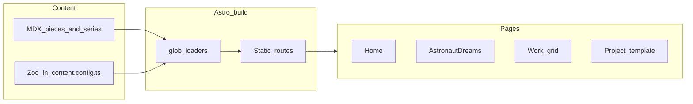

# Handoff — Griffin Portfolio v1

Internal delivery note for the next developer, reviewer, or future you. User-facing quickstart lives in [README.md](../../README.md); task how-tos in [DEVELOPMENT.md](../DEVELOPMENT.md).

---

## TL;DR

- Shipped a static Astro 6 + MDX portfolio: editorial layout, Kanagawa Dragon theme, flagship Astronaut Dreams exhibition (12 works).
- Image inventory: 12 series JPGs + 2 other featured JPGs + 1 home splash (15 files under `public/`); 13 grid slots still SVG placeholders.
- **Live:** https://funkatron.github.io/griffin-portfolio/ — GitHub Pages, auto-deploy on push to `main`.
- **Repo:** https://github.com/funkatron/griffin-portfolio · **PR #1** merged · **Branch:** `main`

---

## At a glance

| Item | Value |
|------|--------|
| Stack | Astro 6.4, `@astrojs/mdx` 6, TypeScript strict |
| Node | ≥ 24.0.0 (`.nvmrc`, Active LTS) |
| Content | MDX collections + Zod in `src/content.config.ts` |
| Theme | Kanagawa Dragon (`src/styles/kanagawa.css`) |
| Default dev URL | http://localhost:4321 |
| Build output | `dist/` |
| Production URL | https://funkatron.github.io/griffin-portfolio/ |
| Deploy | Push to `main` → GitHub Actions → Pages |

---

## User stories (what this serves)

**Visitor:** Browse 3D stills in a bold editorial layout — cold-open home, numbered Astronaut Dreams exhibition, per-piece credits — without shop or print distractions.

**Curator / community:** Share series and individual works; JSON-LD on project pages for basic discoverability.

**Maintainer:** Edit MDX files and drop images into `public/`; optional scripts for batch resize and placeholder regen — no CMS in v1.

---

## What shipped

### Routes

| Route | Behavior |
|-------|----------|
| `/` | Full-bleed splash (`/images/splash.jpg`), links to series + grid |
| `/astronaut-dreams` | Title plate, statement, 12-piece sequence, process strip, colophon |
| `/work` | Asymmetric grid, 27 featured pieces, `?series=` / `?year=` filters |
| `/work/[id]` | Hero, credits overlay (hover/tap), optional gallery/process/video, ←/→ nav, JSON-LD |
| `/about`, `/contact` | Placeholder copy and `mailto:` |

### Content (current)

- **12** Astronaut Dreams pieces — real JPGs in `public/works/`
- **2** other featured pieces with real JPGs (`generative_growth`, `religionpart2`)
- **13** other featured pieces — SVG placeholders
- Series metadata: `src/content/series/astronaut-dreams.mdx`
- Process strip on exhibition page comes from `astronaut-dreams-05` (`processPieceSlug`)

### UI signatures

- Disappearing nav (scroll > 80px or cursor near top)
- Editorial brutalist typography (Cormorant Garamond + Noto Sans JP)
- Kanagawa Dragon palette
- `prefers-reduced-motion` respected (no fade animations when set)

### Tooling

- `scripts/content-catalog.mjs` — shared piece metadata for sync + validate
- `scripts/sync-content.mjs` — regenerate MDX from catalog; optional `sources/` import
- `scripts/validate-content.mjs` — catalog ↔ MDX ↔ assets check
- `scripts/prepare-images.mjs` — optional Sharp pipeline from `sources/`
- `scripts/generate-placeholders.mjs`, `scripts/seed-content.mjs`

---

## Acceptance criteria

| Criterion | Status | Verify |
|-----------|--------|--------|
| Home cold-open hero, no enter gate | Done | Open `/` |
| `/astronaut-dreams` — 12 ordered works, process strip, colophon | Done | Count `NN/12` labels |
| Disappearing nav | Done | Scroll or move cursor to top |
| `/work` — ≥20 entries, series/year filters | Done | 27 featured; toggle filters |
| Project pages — overlay, ←/→, JSON-LD | Done | View source on `/work/astronaut-dreams-01` |
| No print/shop copy | Done | Content review |
| README + dev docs | Done | This handoff + DEVELOPMENT.md |
| All grid slots use real renders | Open | 13 placeholders remain |

---

## Smoke test (5 minutes)

```bash
nvm use && npm install && npm run dev
```

1. `/` — splash fills viewport; Astronaut Dreams + All Work links work.
2. `/astronaut-dreams` — 12 works, process strip, colophon.
3. `/work` — 27 items; filter `?series=astronaut-dreams`.
4. `/work/astronaut-dreams-01` — credits overlay; arrow keys change piece in series.
5. `npm run build` — exit 0, 32 pages in `dist/`.
6. **Production** — https://funkatron.github.io/griffin-portfolio/ loads splash + work images (requires `BASE_PATH` + `pathWithBase` in `OptimizedImage`).

---

## Architecture (content → pages)



Key query helpers: `src/utils/pieces.ts` (`getFeaturedPieces`, `filterPieces`, `getSeriesNeighbors`).

---

## Decisions (why this way)

| Decision | Rationale |
|----------|-----------|
| Astro over Next/CMS | Stills-heavy, rare updates, minimal JS, git-reviewable MDX |
| Placeholders + real series | Credible grid (27 entries) while assets are curated incrementally |
| Kanagawa Dragon | Dark cinematic frame for 3D work; muted contrast for long browsing |
| `id` not `slug` in Astro 6 | Content layer uses filename as `id`; route is `/work/[id]` |
| Local-first, then Pages | Layout signed off locally; shipped on GitHub Pages project subpath |
| Subpath asset URLs | `pathWithBase()` on nav links and `OptimizedImage` src for `/griffin-portfolio/` |

---

## Open items / follow-ups

1. Replace 13 placeholder `other-*` grid heroes with real renders ([Replace images](../DEVELOPMENT.md#replace-images)).
2. Finalize About/Contact copy (name, email, social URLs — currently placeholders).
3. Optional: custom domain (update `SITE_URL` in workflow + rebuild).
4. Optional: add `sharp` as devDependency for CI; Pagefind search; Playwright smoke tests.

---

## Files to know first

| If you need to… | Start here |
|-----------------|------------|
| Change a work | `src/content/pieces/*.mdx` |
| Change exhibition | `src/content/series/astronaut-dreams.mdx`, `src/pages/astronaut-dreams.astro` |
| Change theme | `src/styles/tokens.css`, `src/styles/kanagawa.css` |
| Change nav / layout shell | `src/components/layout/` |
| Change grid layout | `src/components/editorial/AsymmetricGrid.astro` |
| Add route | `src/pages/` |

---

## Git state (as of 2026-06-24)

- Default branch: `main` (production)
- [PR #1](https://github.com/funkatron/griffin-portfolio/pull/1) merged
- Deploy workflow: `.github/workflows/deploy-pages.yml` — push to `main` publishes to Pages
- Latest notable commits: asset path fix (`OptimizedImage` + `BASE_PATH`), Node 24, auto-deploy re-enabled

After v2 scope is defined, update or archive this handoff.
